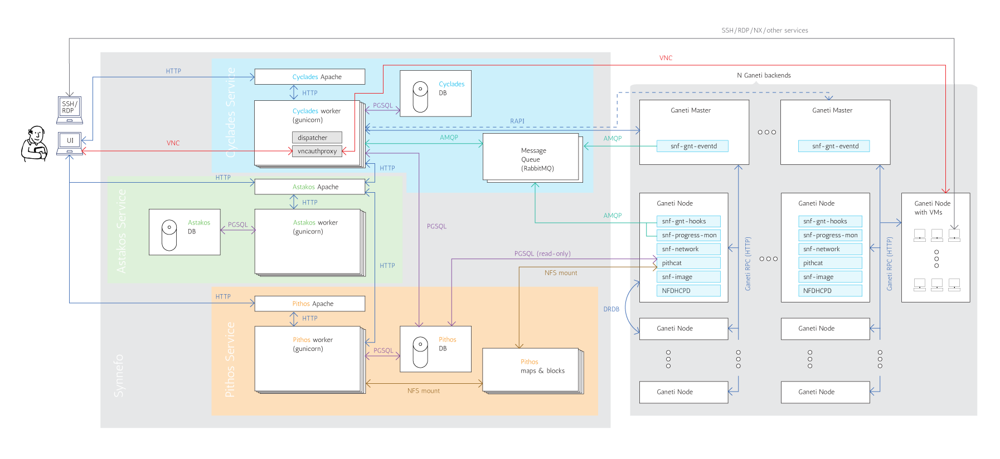

.. _admin-guide:

Synnefo Administrator's Guide
^^^^^^^^^^^^^^^^^^^^^^^^^^^^^

This is the complete Synnefo Administrator's Guide.


General Synnefo Architecture
============================

The following graph shows the whole Synnefo architecture and how it interacts
with multiple Ganeti clusters. We hope that after reading the Administrator's
Guide you will be able to understand every component and all the interactions
between them. It is a good idea to first go through the Quick Administrator's
Guide before proceeding.




Identity Service (Astakos)
==========================


Overview
--------

Authentication methods
~~~~~~~~~~~~~~~~~~~~~~

Local Authentication
````````````````````

LDAP Authentication
```````````````````

.. _shibboleth-auth:

Shibboleth Authentication
`````````````````````````

Astakos can delegate user authentication to a Shibboleth federation.

To setup shibboleth, install package::

  apt-get install libapache2-mod-shib2

Change appropriately the configuration files in ``/etc/shibboleth``.

Add in ``/etc/apache2/sites-available/synnefo-ssl``::

  ShibConfig /etc/shibboleth/shibboleth2.xml
  Alias      /shibboleth-sp /usr/share/shibboleth

  <Location /im/login/shibboleth>
    AuthType shibboleth
    ShibRequireSession On
    ShibUseHeaders On
    require valid-user
  </Location>

and before the line containing::

  ProxyPass        / http://localhost:8080/ retry=0

add::

  ProxyPass /Shibboleth.sso !

Then, enable the shibboleth module::

  a2enmod shib2

After passing through the apache module, the following tokens should be
available at the destination::

  eppn # eduPersonPrincipalName
  Shib-InetOrgPerson-givenName
  Shib-Person-surname
  Shib-Person-commonName
  Shib-InetOrgPerson-displayName
  Shib-EP-Affiliation
  Shib-Session-ID

Finally, add 'shibboleth' in ``ASTAKOS_IM_MODULES`` list. The variable resides
inside the file ``/etc/synnefo/20-snf-astakos-app-settings.conf``

Architecture
------------

Prereqs
-------

Installation
------------

Configuration
-------------

Working with Astakos
--------------------

User activation methods
~~~~~~~~~~~~~~~~~~~~~~~

When a new user signs up, he/she is not marked as active. You can see his/her
state by running (on the machine that runs the Astakos app):

.. code-block:: console

   $ snf-manage user-list

There are two different ways to activate a new user. Both need access to a
running :ref:`mail server <mail-server>`.

Manual activation
`````````````````

You can manually activate a new user that has already signed up, by sending
him/her an activation email. The email will contain an approriate activation
link, which will complete the activation process if followed. You can send the
email by running:

.. code-block:: console

   $ snf-manage user-activation-send <user ID or email>

Be sure to have already setup your mail server and defined it in your Synnefo
settings, before running the command.

Automatic activation
````````````````````

FIXME: Describe Regex activation method

Astakos advanced operations
---------------------------

Adding "Terms of Use"
~~~~~~~~~~~~~~~~~~~~~

Astakos supports versioned terms-of-use. First of all you need to create an
html file that will contain your terms. For example, create the file
``/usr/share/synnefo/sample-terms.html``, which contains the following:

.. code-block:: console

   <h1>~okeanos terms</h1>

   These are the example terms for ~okeanos

Then, add those terms-of-use with the snf-manage command:

.. code-block:: console

   $ snf-manage term-add /usr/share/synnefo/sample-terms.html

Your terms have been successfully added and you will see the corresponding link
appearing in the Astakos web pages' footer.

Enabling reCAPTCHA
~~~~~~~~~~~~~~~~~~

Astakos supports the `reCAPTCHA <http://www.google.com/recaptcha>`_ feature.
If enabled, it protects the Astakos forms from bots. To enable the feature, go
to https://www.google.com/recaptcha/admin/create and create your own reCAPTCHA
key pair. Then edit ``/etc/synnefo/20-snf-astakos-app-settings.conf`` and set
the corresponding variables to reflect your newly created key pair. Finally, set
the ``ASTAKOS_RECAPTCHA_ENABLED`` variable to ``True``:

.. code-block:: console

   ASTAKOS_RECAPTCHA_PUBLIC_KEY = 'example_recaptcha_public_key!@#$%^&*('
   ASTAKOS_RECAPTCHA_PRIVATE_KEY = 'example_recaptcha_private_key!@#$%^&*('

   ASTAKOS_RECAPTCHA_ENABLED = True

Restart the service on the Astakos node(s) and you are ready:

.. code-block:: console

   # /etc/init.d/gunicorn restart

Checkout your new Sign up page. If you see the reCAPTCHA box, you have setup
everything correctly.


File Storage Service (Pithos)
=============================

Overview
--------

Architecture
------------

Prereqs
-------

Installation
------------

Configuration
-------------

Working with Pithos
-------------------

Pithos advanced operations
--------------------------


Compute/Network/Image Service (Cyclades)
========================================

Compute Overview
----------------

Network Overview
----------------

Image Overview
--------------

Architecture
------------

Asynchronous communication with Ganeti backends
~~~~~~~~~~~~~~~~~~~~~~~~~~~~~~~~~~~~~~~~~~~~~~~
Synnefo uses Google Ganeti backends for VM cluster management. In order Cyclades
to be able to handle thousand of user requests, Cyclades and Ganeti communicate
asynchronously. Briefly, requests are submitted to Ganeti, and asynchronous
notifications about the progress of jobs is received from the backends. The
architecture and communication with a Ganeti backend is shown the below graph.

.. image:: images/cyclades-ganeti-communication.png
   :width: 50%
   :target: _images/cyclades-ganeti-communication.png

Cyclades API server is responsible for handling user requests. Read-only
requests are directly served by looking up the Cyclades DB. If the request
needs an action in the Ganeti backend, Cyclades submit jobs to the Ganeti
master using the `Ganeti RAPI <http://docs.ganeti.org/ganeti/2.2/html/rapi.html>`_.

While Ganeti executes the job, snf-ganeti-eventd, snf-ganeti-hook and
snf-progress-monitor are monitoring the progress of the job and send
corresponding messages to the RabbitMQ servers. Specially,

* *snf-ganeti-eventd* sends messages about operations affecting the operating
  state of instances and networks. Works by monitoring Ganeti job queue.
* *snf-ganeti_hook* sends messages about the NIC of instances. It includes a
  number of `Ganeti hooks <http://docs.ganeti.org/ganeti/2.2/html/hooks.html>`_
  for customisation of operations.
* *snf-progress_monitor* sends messages about the progress of building a new
  instance and image deployment, triggered by snf-image.

Snf-dispatcher consumes messages from the RabbitMQ queues, process these
messages and properly updates the state of Cyclades DB. Subsequent requests in
Cyclades API, will retrieve the updated state from the DB.


Prereqs
-------

Installation
------------

Configuration
-------------

Working with Cyclades
---------------------

Managing Ganeti Backends
~~~~~~~~~~~~~~~~~~~~~~~~

Since v0.11 Synnefo is able to manage multiple Ganeti clusters (backends)
making it capable to scale to thousand of VMs. Backends can be dynamically be
added or removed via `snf-manage` commands.

From the VM perspective, each VM that is created is allocated to a Ganeti
backend by Cyclades backend allocator. The VM is "pinned" to this backend, and
can not change through its lifetime. The backend allocator decides in which
backend to spawn the VM based of the available resources of its backend, trying
to balance the load between them.

Handling of Networks, as far as backends are concerned, is based on whether the
network is public or not. Public networks are created through `snf-manage
network-create` command, and are only created to one backend. Private networks
are created in all backends in order to ensure that VMs in all backends can
be connected to the same private network.

Listing existing backend
````````````````````````
To find out the available Ganeti backends, run:

.. code-block:: console

   $ snf-manage backend-list

Adding a new Ganeti backend
```````````````````````````
Backends are dynamically added under the control of Synnefo with `snf-manage
backend-add` command. In this section it is assumed that a Ganeti cluster,
named cluster.example.com is already up and running and configured to be able
to host Synnefo VMs.

To add the Ganeti cluster, run:

.. code-block:: console

   $ snf-manage backend-add --clustername=cluster.example.com --user="synnefo_user" --pass="synnefo_pass"

where clustername is the Cluster hostname of the Ganeti cluster, and user
and pass are the credentials for the Ganeti RAPI user. All of the backends
attributes can also be changed dynamically with `snf-manage backend-modify`
command.

This command will also create all private networks to the new Backend. You can
verify that the backend is added, by running `snf-manage backend-list` command.

Note that no VMs will be spawned to this backend, until a public network is
associated with it.

Removing an existing Ganeti backend
```````````````````````````````````
In order to remove an existing backend, run:

.. code-block:: console

   # snf-manage backend-remove ID

This command will fail if there are active VMs to the backend. Also, the
backend is not cleaned before removing it, so all of Synnefo private networks
will be left.

Allocation of VMS in Ganneti backends
`````````````````````````````````````
As already mentioned, the backend allocator is responsible allocating new VMs
to backends. This allocator is not concerned about the Ganeti node that will
host the VM, which is chosen by the Ganeti allocator.

The decision about which backend will host a VM is based on the available
resources. The allocator computes a score for each backend, that shows its load
factor, and the one with the minimum score is chosen. The admin can exclude
backends from the allocation phase by marking them as drained by running:

.. code-block:: console

   $ snf-manage backend-modify --drained ID

The backend resources are periodically updated, at a period defined by
`BACKEND_REFRESH_MIN` setting or by running `snf-manage backend-update-status`
command. It is advised to have a cron job running this command at a smaller
interval than `BACKEND_REFRESH_MIN` in order to remove the load of refreshing
the backends stats from the VM creation phase.

Finally, the admin can decide to have a user VMs in a specific backend, with
the `BACKEND_PER_USER` setting.


Managing Virtual Machines
~~~~~~~~~~~~~~~~~~~~~~~~~

As mentioned, Cyclades relies on Ganeti for management of VMs. The
administrator can handle Cyclades VMs just like any other Ganeti instance, via
`gnt-instance` commands. All Ganeti instances that belong to Synnefo, are
separated from others by a prefix in their names. This prefix is defined in
`BACKEND_PREFIX_ID` setting in `/etc/synnefo/20-snf-cyclades-app-backend.conf`.


Apart from handling instances directly in Ganeti level, a number of snf-manage
commands are available:

* snf-manage server-list: List servers
* snf-manage server-show: Show information about server from Cyclades DB
* snf-manage server-inspect: Inspect the state of the server in DB and Ganeti
* snf-manage server-modify: Modify the state of the server in Cycldes DB
* snf-manage server-create: Create a new server
* snf-manage server-import: Import an existing Ganeti instance under control of Cyclades


Managing Virtual Networks
~~~~~~~~~~~~~~~~~~~~~~~~~

Cyclades is able to create and manage Virtual Networks. Networking is desployment
specific and must be customized based on the specific needs of the system
administrator. For better understanding networking please refer to :ref:`Network <networks>`
section.

Exactly as Cyclades VMs can be handled like Ganeti instances, Cyclades Networks
can also by handled as Ganeti networks, via `gnt-network commands`. All Ganeti
networks that belong to Synnefo are named with a prefix
`${BACKEND_PREFIX_ID}-net-`.

There are also the following snf-manage commands for managing networks:

* snf-manage network-list: List networks
* snf-manage network-show: Show information about network from Cyclades DB
* snf-manage network-inspect: Inspect the state of the network in DB and Ganeti backends
* snf-manage network-modify: Modify the state of the network in Cycldes DB
* snf-manage network-create: Create a new network
* snf-manage network-remove: Remove a network

Managing Network Resources
```````````````````````````

Proper operation of of Cyclades Network Service depends on unique assignment of
specific resources to each virtual network. Specifically, these resources are:

* IP addresses. Cyclades creates a Pool of IPs for each Network, and assignes a
  unique IP address for each VM connecting to a Network. You can see the IP pool
  of each network by running `snf-manage network-inspect <network_ID>`. IP pools
  are automatically created and managed by Cyclades, depending of the subnet of
  the network.
* Bridges corresponding to physical VLANs, which are required for networks of
  `PRIVATE_PHYSICAL_VLAN` type, to guarantee isolation between networks and
  MAC prefixes, which are required to guarantee isolation between networks
  of `PRIVATE_MAC_PREFIX` type. Cyclades allocates these two resources from
  pools that are created by the administrator with `snf-manage pool-create`
  management command.


Pools are created using the `snf-manage pool-create` command.

.. code-block:: console

   # snf-manage pool-create --type=bridge --base=prv --size=20

will create a pool of bridges, containing bridges prv1, prv2,..prv21.

You can verify the creation of the pool, and check its contents by running:

.. code-block:: console

   # snf-manage pool-list
   # snf-manage pool-show --type=bridge 1

With the same commands you can handle the pool of MAC prefixes. For example:

.. code-block:: console

   # snf-manage pool-create --type=mac-prefix --base=aa:00:0 --size=65536

will create a pool of mac-prefixes from aa:00:1 to b9:ff:f. The MAC prefix pool
is responsible from providing only unicast and locally administered MAC
addresses, so many of these prefixes will be externally reserved, to exclude
from allocation.

Cyclades advanced operations
----------------------------

Reconciliation mechanism
~~~~~~~~~~~~~~~~~~~~~~~~
On certain occasions, such as a Ganeti or RabbitMQ failure, the state of
Cyclades database may differ from the real state of VMs and networks in the
Ganeti backends. The reconciliation process is designed to synchronize
the state of the Cyclades DB with Ganeti. There are two management commands
for reconciling VMs and Networks

Reconciling VirtualMachine
``````````````````````````
Reconciliation of VMs detects the following conditions:
 * Stale DB servers without corresponding Ganeti instances
 * Orphan Ganeti instances, without corresponding DB entries
 * Out-of-sync state for DB entries wrt to Ganeti instances

To detect all inconsistencies you can just run:

.. code-block:: console
  $ snf-manage reconcile --detect-all

Adding the `--fix-all` option, will do the actual synchronization:

.. code-block:: console
  $ snf-manage reconcile --detect-all --fix-all

Please see ``snf-manage reconcile --help`` for all the details.


Reconciling Networks
````````````````````
Reconciliation of Networks detects the following conditions:
  * Stale DB networks without corresponding Ganeti networks
  * Orphan Ganeti networks, without corresponding DB entries
  * Private networks that are not created to all Ganeti backends
  * Unsynchronized IP pools

To detect all inconsistencies you can just run:

.. code-block:: console
  $ snf-manage reconcile-networks

Adding the `--fix-all` option, will do the actual synchronization:

.. code-block:: console
  $ snf-manage reconcile-networks --fix-all

Please see ``snf-manage reconcile-networks --help`` for all the details.


Block Storage Service (Archipelago)
===================================

Overview
--------

Architecture
------------

Prereqs
-------

Installation
------------

Configuration
-------------

Working with Archipelago
------------------------

Archipelago advanced operations
-------------------------------


The "kamaki" API client
=======================

To upload, register or modify an image you will need the **kamaki** tool.
Before proceeding make sure that it is configured properly. Verify that
*image_url*, *storage_url*, and *token* are set as needed:

.. code-block:: console

   $ kamaki config list

To chage a setting use ``kamaki config set``:

.. code-block:: console

   $ kamaki config set image_url https://cyclades.example.com/plankton
   $ kamaki config set storage_url https://pithos.example.com/v1
   $ kamaki config set token ...

Upload Image
------------

As a shortcut, you can configure a default account and container that will be
used by the ``kamaki store`` commands:

.. code-block:: console

   $ kamaki config set storage_account images@example.com
   $ kamaki config set storage_container images

If the container does not exist, you will have to create it before uploading
any images:

.. code-block:: console

   $ kamaki store create images

You are now ready to upload an image. You can upload it with a Pithos+ client,
or use kamaki directly:

.. code-block:: console

   $ kamaki store upload ubuntu.iso

You can use any Pithos+ client to verify that the image was uploaded correctly.
The full Pithos URL for the previous example will be
``pithos://images@example.com/images/ubuntu.iso``.


Register Image
--------------

To register an image you will need to use the full Pithos+ URL. To register as
a public image the one from the previous example use:

.. code-block:: console

   $ kamaki glance register Ubuntu pithos://images@example.com/images/ubuntu.iso --public

The ``--public`` flag is important, if missing the registered image will not
be listed by ``kamaki glance list``.

Use ``kamaki glance register`` with no arguments to see a list of available
options. A more complete example would be the following:

.. code-block:: console

   $ kamaki glance register Ubuntu pithos://images@example.com/images/ubuntu.iso \
            --public --disk-format diskdump --property kernel=3.1.2

To verify that the image was registered successfully use:

.. code-block:: console

   $ kamaki glance list -l


Miscellaneous
=============

.. RabbitMQ
RabbitMQ Broker
---------------

Queue nodes run the RabbitMQ sofware, which provides AMQP functionality. To
guarantee high-availability, more than one Queue nodes should be deployed, each
of them belonging to the same `RabbitMQ cluster
<http://www.rabbitmq.com/clustering.html>`_. Synnefo uses RabbitMQ
active/active `High Available Queues <http://www.rabbitmq.com/ha.html>`_ that
are mirrored on nodes within a RabbitMQ cluster.

The RabbitMQ nodes that form the cluster, are declared to Synnefo through
the `AMQP_HOSTS` setting. Each time a Synnefo component needs to connect
RabbitMQ, one of this nodes is chosen in a random way. The client that
synnefo uses to connect with RabbitMQ, silently handles connection failures
and tries to reconnect to a different node. As long as one of these nodes
are up and running, functionality of synnefo should no be downgraded by
RabbitMQ node failures.

All the queues that are being used are declared as durable, meaning that
messages are persistently stored to RabbitMQ until are successfully processed
by a client.

Currently, RabbitMQ is used by the following components:

* snf-ganeti-eventd, snf-ganeti-hook and snf-progress-monitor:
  These components send messages concerning the status and progress of
  jobs in the Ganeti backend.
* snf-dispatcher: This daemon, consumes the messages that are send from
  the above components, and updates the Cyclades DB.

Installation
````````````

Please check RabbitMQ documentation which covers extensively the `installation
of RabbitMQ server <http://www.rabbitmq.com/download.html>`_ and the setup of a
`RabbitMQ cluster <http://www.rabbitmq.com/clustering.html>`_. Also, check out
the `web management plugin <http://www.rabbitmq.com/management.html>`_ that can
be useful for managing and monitoring RabbitMQ.

For a basic installation of RabbitMQ on two nodes (node1 and node2) you can do
the follow steps:

On both nodes, install rabbitmq-server and create a synnefo user:

.. code-block:: console

  $ apt-get install rabbitmq-server
  $ rabbitmqctl add_user synnefo "example_pass"
  $ rabbitmqctl set_permissions synnefo  ".*" ".*" ".*"

Also guarantee that two nodes share the same cookie, by running

.. code-block:: console

  $ scp node1:/var/lib/rabbitmq/.erlang.cookie node2:/var/lib/rabbitmq/.erlang.cookie

and restart the nodes:

.. code-block:: console

  $ /etc/init.d/rabbitmq-server restart


To setup the RabbitMQ cluster run:

.. code-block:: console

  root@node2: rabbitmqctl stop_app
  root@node2: rabbitmqctl reset
  root@node2: rabbitmqctl cluster rabbit@node1 rabbit@node2
  root@node2: rabbitmqctl start_app

You can verify that the cluster is set up correctly by running:

.. code-block:: console

  root@node2: rabbitmqctl cluster_status


Admin tool: snf-manage
----------------------

``snf-manage`` is a tool used to perform various administrative tasks. It needs
to be able to access the django database, so the following should be able to
import the Django settings.

Additionally, administrative tasks can be performed via the admin web interface
located in /admin. Only users of type ADMIN can access the admin pages. To
change the type of a user to ADMIN, snf-admin can be used:

.. code-block:: console

   $ snf-manage user-modify 42 --type ADMIN

Logging
-------

Logging in Synnefo is using Python's logging module. The module is configured
using dictionary configuration, whose format is described here:

http://docs.python.org/release/2.7.1/library/logging.html#logging-config-dictschema

Note that this is a feature of Python 2.7 that we have backported for use in
Python 2.6.

The logging configuration dictionary is defined in
`/etc/synnefo/10-snf-webproject-logging.conf`

The administrator can have finer logging control by modifying the `LOGGING_SETUP`
dictionary, and defining subloggers with different handlers and log levels.
e.g. To enable debug messages only for the API set the level of 'synnefo.api'
to 'DEBUG'

By default the Django webapp and snf-manage logs to syslog, while
snf-dispatcher logs to `/var/log/synnefo/dispatcher.log`.


Scaling up to multiple nodes
============================

Here we will describe how to deploy all services, interconnected with each
other, on multiple physical nodes.

synnefo components
------------------

You need to install the appropriate synnefo software components on each node,
depending on its type, see :ref:`Architecture <cyclades-architecture>`.

Please see the page of each synnefo software component for specific
installation instructions, where applicable.

Install the following synnefo components:

Nodes of type :ref:`APISERVER <APISERVER_NODE>`
    Components
    :ref:`snf-common <snf-common>`,
    :ref:`snf-webproject <snf-webproject>`,
    :ref:`snf-cyclades-app <snf-cyclades-app>`
Nodes of type :ref:`GANETI-MASTER <GANETI_MASTER>` and :ref:`GANETI-NODE <GANETI_NODE>`
    Components
    :ref:`snf-common <snf-common>`,
    :ref:`snf-cyclades-gtools <snf-cyclades-gtools>`
Nodes of type :ref:`LOGIC <LOGIC_NODE>`
    Components
    :ref:`snf-common <snf-common>`,
    :ref:`snf-webproject <snf-webproject>`,
    :ref:`snf-cyclades-app <snf-cyclades-app>`.


Upgrade Notes
=============

Cyclades upgrade notes
----------------------

.. toctree::
   :maxdepth: 2

   cyclades-upgrade

Changelog
=========
