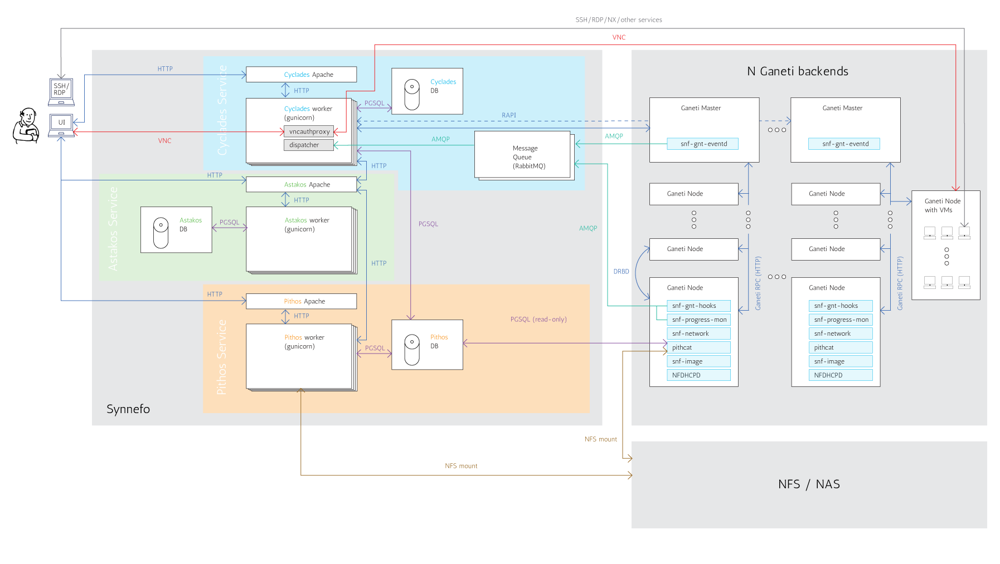
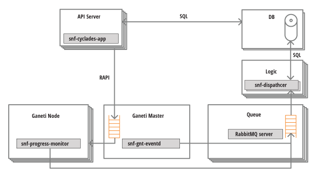
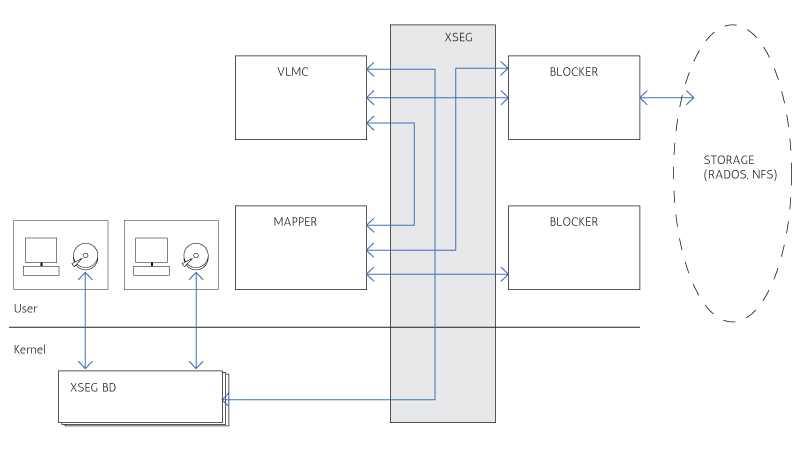
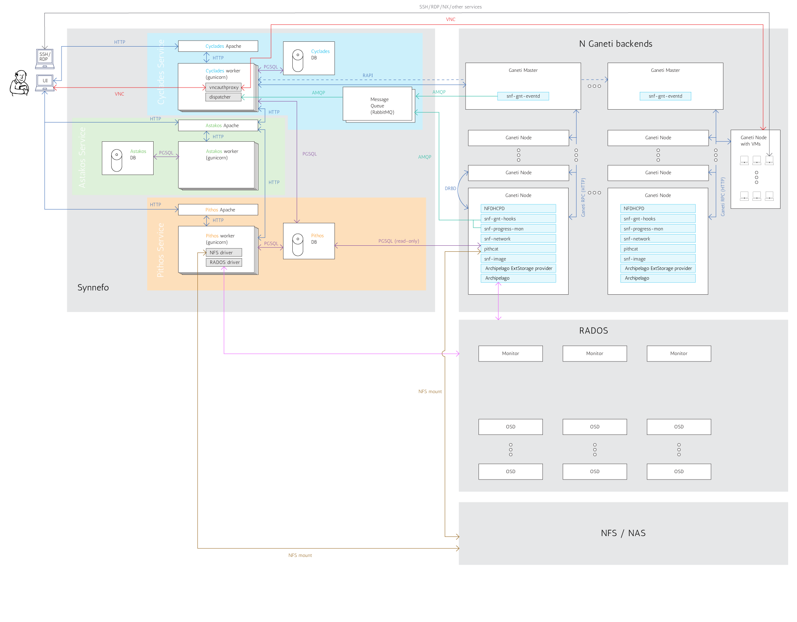
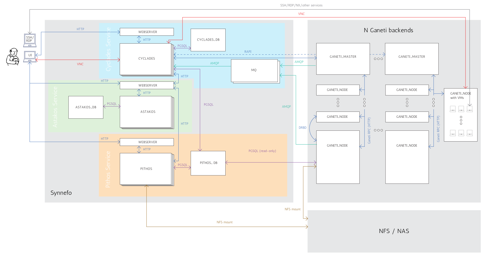

.. _admin-guide:

Synnefo Administrator's Guide
^^^^^^^^^^^^^^^^^^^^^^^^^^^^^

This is the complete Synnefo Administrator's Guide.


.. _syn+archip:

General Synnefo Architecture
============================

The following figure shows a detailed view of the whole Synnefo architecture
and how it interacts with multiple Ganeti clusters. We hope that after reading
the Administrator's Guide you will be able to understand every component and
all the interactions between them.



Synnefo also supports RADOS as an alternative storage backend for
Files/Images/VM disks. You will find the :ref:`corresponding figure
<syn+archip+rados>` later in this guide.


Identity Service (Astakos)
==========================


Authentication methods
----------------------

Astakos supports multiple authentication methods:

 * local username/password
 * LDAP / Active Directory
 * SAML 2.0 (Shibboleth) federated logins
 * Google
 * Twitter
 * LinkedIn

.. _shibboleth-auth:

Shibboleth Authentication
~~~~~~~~~~~~~~~~~~~~~~~~~

Astakos can delegate user authentication to a Shibboleth federation.

To setup shibboleth, install package::

  apt-get install libapache2-mod-shib2

Change appropriately the configuration files in ``/etc/shibboleth``.

Add in ``/etc/apache2/sites-available/synnefo-ssl``::

  ShibConfig /etc/shibboleth/shibboleth2.xml
  Alias      /shibboleth-sp /usr/share/shibboleth

  <Location /ui/login/shibboleth>
    AuthType shibboleth
    ShibRequireSession On
    ShibUseHeaders On
    require valid-user
  </Location>

and before the line containing::

  ProxyPass        / http://localhost:8080/ retry=0

add::

  ProxyPass /Shibboleth.sso !

Then, enable the shibboleth module::

  a2enmod shib2

After passing through the apache module, the following tokens should be
available at the destination::

  eppn # eduPersonPrincipalName
  Shib-InetOrgPerson-givenName
  Shib-Person-surname
  Shib-Person-commonName
  Shib-InetOrgPerson-displayName
  Shib-EP-Affiliation
  Shib-Session-ID

Finally, add 'shibboleth' in ``ASTAKOS_IM_MODULES`` list. The variable resides
inside the file ``/etc/synnefo/20-snf-astakos-app-settings.conf``

Twitter Authentication
~~~~~~~~~~~~~~~~~~~~~~

To enable twitter authentication while signed in under a Twitter account,
visit dev.twitter.com/apps.

Click Create an application.

Fill the necessary information and for callback URL give::

    https://node1.example.com/ui/login/twitter/authenticated

Finally, add 'twitter' in ``ASTAKOS_IM_MODULES`` list. The variable resides
inside the file ``/etc/synnefo/20-snf-astakos-app-settings.conf``

Google Authentication
~~~~~~~~~~~~~~~~~~~~~

To enable google authentication while signed in under a Google account,
visit https://code.google.com/apis/console/.

Under API Access select Create another client ID, select Web application,
expand more options in Your site or hostname section and in Authorized
Redirect URIs add:


Fill the necessary information and for callback URL give::

    https://node1.example.com/ui/login/google/authenticated

Finally, add 'google' in ``ASTAKOS_IM_MODULES`` list. The variable resides
inside the file ``/etc/synnefo/20-snf-astakos-app-settings.conf``


Working with Astakos
--------------------

User registration
~~~~~~~~~~~~~~~~~

When a new user signs up, he/she is not directly marked as active. You can see 
his/her state by running (on the machine that runs the Astakos app):

.. code-block:: console

   $ snf-manage user-list

More detailed user status is provided in the `status` field of the `user-show` 
command:

.. code-block:: console

  $ snf-manage user-show <user-id>

  id                  : 6
  uuid                : 78661411-5eed-412f-a9ea-2de24f542c2e
  status              : Accepted/Active (accepted policy: manual)
  email               : user@synnefo.org
  ....

Based on the `astakos-app` configuration, there are several ways for a user to
get verified and activated in order to be able to login. We discuss the user
verification and activation flow in the following section.

User activation flow
````````````````````

A user can register for an account using the astakos signup form. Once the form
is submited successfully a user entry is created in astakos database. That entry
is passed through the astakos activation backend which handles whether the user
should be automatically verified and activated.

Email verification
``````````````````

The verification process takes place in order to ensure that the user owns the
email provided during the signup process. By default, after each successful
signup astakos notifies user with an verification url via email. 

At this stage:

    * subsequent registrations invalidate and delete the previous registrations 
      of the same email address.

    * in case user misses the initial notification, additional emails can be
      send either via the url which is prompted to the user if he tries to
      login, or by the administrator using the ``snf-manage user-activation-send
      <userid>`` command.

    * administrator may also enforce a user to get verified using the
      ``snf-manage user-modify --verify <userid>`` command.

Account activation
``````````````````

Once the user gets verified, it is time for Astakos to decide whether or not to
proceed through user activation process. If ``ASTAKOS_MODERATION_ENABLED``
setting is set to ``False`` (default value) user gets activated automatically. 

In case the moderation is enabled Astakos may still automatically activate the
user in the following cases:

    * User email matches any of the regular expressions defined in
      ``ASTAKOS_RE_USER_EMAIL_PATTERNS`` (defaults to ``[]``)
    * User used a signup method (e.g. ``shibboleth``) for which automatic
      activation is enabled (see 
      :ref:`authentication methods policies <auth_methods_policies>`).

If all of the above fail to trigger automatic activation, an email is sent to
the persons listed in ``HELPDESK``, ``MANAGERS`` and ``ADMINS`` settings,
notifing that there is a new user pending for moderation and that it's up to
the administrator to decide if the user should be activated. The UI also shows
a corresponding 'pending moderation' message to the user. The administrator can
activate a user using the ``snf-manage user-modify`` command:

.. code-block:: console

    # command to activate a pending user
    $ snf-manage user-modify --accept <userid>

    # command to reject a pending user
    $ snf-manage user-modify --reject --reject-reason="spammer" <userid>

Once the activation process finishes, a greeting message is sent to the user
email address and a notification for the activation to the persons listed in
``HELPDESK``, ``MANAGERS`` and ``ADMINS`` settings. Once activated the user is
able to login and access the Synnefo services.

Additional authentication methods
`````````````````````````````````

Astakos supports third party logins from external identity providers. This
can be usefull since it allows users to use their existing credentials to 
login to astakos service.

Currently astakos supports the following identity providers:

    * `Shibboleth <http://www.internet2.edu/shibboleth>`_ (module name
      ``shibboleth``)
    * `Google <https://developers.google.com/accounts/docs/OAuth2>`_ (module
      name ``google``)
    * `Twitter <https://dev.twitter.com/docs/auth>`_ (module name ``twitter``)
    * `LinkedIn <http://developer.linkedin.com/documents/authentication>`_
      (module name ``linkedin``)

To enable any of the above modules (by default only ``local`` accounts are
allowed), retrieve and set the required provider settings and append the 
module name in ``ASTAKOS_IM_MODULES``.

.. code-block:: python

    # settings from https://code.google.com/apis/console/
    ASTAKOS_GOOGLE_CLIENT_ID = '1111111111-epi60tvimgha63qqnjo40cljkojcann3.apps.googleusercontent.com'
    ASTAKOS_GOOGLE_SECRET = 'tNDQqTDKlTf7_LaeUcWTWwZM'
    
    # let users signup and login using their google account
    ASTAKOS_IM_MODULES = ['local', 'google']


.. _auth_methods_policies:

Authentication method policies
``````````````````````````````

Astakos allows you to override the default policies for each enabled provider 
separately by adding the approriate settings in your ``.conf`` files in the 
following format:

**ASTAKOS_AUTH_PROVIDER_<module>_<policy>_POLICY**

Available policies are:

    * **CREATE** Users can signup using that provider (default: ``True``) 
    * **REMOVE/ADD** Users can remove/add login method from their profile 
      (default: ``True``)
    * **AUTOMODERATE** Automatically activate users that signup using that
      provider (default: ``False``)
    * **LOGIN** Whether or not users can use the provider to login (default:
      ``True``).

e.g. to enable automatic activation for your academic users, while keeping 
locally signed up users under moderation you can apply the following settings.

.. code-block:: python

    ASTAKOS_AUTH_PROVIDER_SHIBBOLETH_AUTOMODERATE_POLICY = True
    ASTAKOS_AUTH_PROVIDER_SHIBBOLETH_REMOVE_POLICY = False

User login
~~~~~~~~~~

During the logging procedure, the user is authenticated by the respective
identity provider.

If ``ASTAKOS_RECAPTCHA_ENABLED`` is set and the user fails several times
(``ASTAKOS_RATELIMIT_RETRIES_ALLOWED`` setting) to provide the correct
credentials for a local account, he/she is then prompted to solve a captcha
challenge.

Upon success, the system renews the token (if it has expired), logins the user
and sets the cookie, before redirecting the user to the ``next`` parameter
value.

Setting quota limits
~~~~~~~~~~~~~~~~~~~~

Set default quota
`````````````````

In 20-snf-astakos-app-settings.conf, 
uncomment the default setting ``ASTAKOS_SERVICES``
and customize the ``'uplimit'`` values.
These are the default base quota for all users.

To apply your configuration run::

    # snf-manage astakos-init --load-service-resources
    # snf-manage quota --sync

Set base quota for individual users
```````````````````````````````````

For individual users that need different quota than the default
you can set it for each resource like this::

    # use this to display quota / uuid
    # snf-manage user-show 'uuid or email' --quota

    # snf-manage user-modify 'user-uuid' --set-base-quota 'cyclades.vm' 10


Enable the Projects feature
~~~~~~~~~~~~~~~~~~~~~~~~~~~

If you want to enable the projects feature so that users may apply
on their own for resources by creating and joining projects,
in ``20-snf-astakos-app-settings.conf`` set::

    # this will make the 'projects' page visible in the dashboard
    ASTAKOS_PROJECTS_VISIBLE = True

You can change the maximum allowed number of pending project applications
per user with::

    # snf-manage resource-modify astakos.pending_app --limit <number>

You can also set a user-specific limit with::

    # snf-manage user-modify 'user-uuid' --set-base-quota 'astakos.pending_app' 5

When users apply for projects they are not automatically granted
the resources. They must first be approved by the administrator.

To list pending project applications in astakos::

    # snf-manage project-list --pending

Note the last column, the application id. To approve it::

    # <app id> from the last column of project-list
    # snf-manage project-control --approve <app id>

To deny an application::

    # snf-manage project-control --deny <app id>

Users designated as *project admins* can approve, deny, or modify
an application through the web interface. In
``20-snf-astakos-app-settings.conf`` set::

    # UUIDs of users that can approve or deny project applications from the web.
    ASTAKOS_PROJECT_ADMINS = [<uuid>, ...]


Astakos advanced operations
---------------------------

Adding "Terms of Use"
~~~~~~~~~~~~~~~~~~~~~

Astakos supports versioned terms-of-use. First of all you need to create an
html file that will contain your terms. For example, create the file
``/usr/share/synnefo/sample-terms.html``, which contains the following:

.. code-block:: console

   <h1>My cloud service terms</h1>

   These are the example terms for my cloud service

Then, add those terms-of-use with the snf-manage command:

.. code-block:: console

   $ snf-manage term-add /usr/share/synnefo/sample-terms.html

Your terms have been successfully added and you will see the corresponding link
appearing in the Astakos web pages' footer.

During the account registration, if there are approval terms, the user is
presented with an "I agree with the Terms" checkbox that needs to get checked
in order to proceed.

In case there are new approval terms that the user has not signed yet, the
``signed_terms_required`` view decorator redirects to the ``approval_terms``
view, so the user will be presented with the new terms the next time he/she
logins.

Enabling reCAPTCHA
~~~~~~~~~~~~~~~~~~

Astakos supports the `reCAPTCHA <http://www.google.com/recaptcha>`_ feature.
If enabled, it protects the Astakos forms from bots. To enable the feature, go
to https://www.google.com/recaptcha/admin/create and create your own reCAPTCHA
key pair. Then edit ``/etc/synnefo/20-snf-astakos-app-settings.conf`` and set
the corresponding variables to reflect your newly created key pair. Finally, set
the ``ASTAKOS_RECAPTCHA_ENABLED`` variable to ``True``:

.. code-block:: console

   ASTAKOS_RECAPTCHA_PUBLIC_KEY = 'example_recaptcha_public_key!@#$%^&*('
   ASTAKOS_RECAPTCHA_PRIVATE_KEY = 'example_recaptcha_private_key!@#$%^&*('

   ASTAKOS_RECAPTCHA_ENABLED = True

Restart the service on the Astakos node(s) and you are ready:

.. code-block:: console

   # /etc/init.d/gunicorn restart

Checkout your new Sign up page. If you see the reCAPTCHA box, you have setup
everything correctly.


Astakos internals
-----------------

X-Auth-Token
~~~~~~~~~~~~

Alice requests a specific resource from a cloud service e.g.: Pithos. In the
request she supplies the `X-Auth-Token` to identify whether she is eligible to
perform the specific task. The service contacts Astakos through its
``/account/v1.0/authenticate`` api call (see :ref:`authenticate-api-label`)
providing the specific ``X-Auth-Token``. Astakos checkes whether the token
belongs to an active user and it has not expired and returns a dictionary
containing user related information. Finally the service uses the ``uniq``
field included in the dictionary as the account string to identify the user
accessible resources.

.. _authentication-label:

Django Auth methods and Backends
~~~~~~~~~~~~~~~~~~~~~~~~~~~~~~~~

Astakos incorporates Django user authentication system and extends its User model.

Since username field of django User model has a limitation of 30 characters,
AstakosUser is **uniquely** identified by the ``email`` instead. Therefore,
``astakos.im.authentication_backends.EmailBackend`` is served to authenticate a
user using email if the first argument is actually an email, otherwise tries
the username.

A new AstakosUser instance is assigned with a uui as username and also with a
``auth_token`` used by the cloud services to authenticate the user.
``astakos.im.authentication_backends.TokenBackend`` is also specified in order
to authenticate the user using the email and the token fields.

Logged on users can perform a number of actions:

 * access and edit their profile via: ``/im/profile``.
 * change their password via: ``/im/password``
 * send feedback for grnet services via: ``/im/send_feedback``
 * logout (and delete cookie) via: ``/im/logout``

Internal Astakos requests are handled using cookie-based Django user sessions.

External systems should forward to the ``/login`` URI. The server,
depending on its configuration will redirect to the appropriate login page.
When done with logging in, the service's login URI should redirect to the URI
provided with next, adding user and token parameters, which contain the email
and token fields respectively.

The login URI accepts the following parameters:

======================  =========================
Request Parameter Name  Value
======================  =========================
next                    The URI to redirect to when the process is finished
renew                   Force token renewal (no value parameter)
force                   Force logout current user (no value parameter)
======================  =========================

External systems inside the ``ASTAKOS_COOKIE_DOMAIN`` scope can acquire the
user information by the cookie identified by ``ASTAKOS_COOKIE_NAME`` setting
(set during the login procedure).

Finally, backend systems having acquired a token can use the
:ref:`authenticate-api-label` API call from a private network or through HTTPS.


Compute/Network/Image Service (Cyclades)
========================================

Working with Cyclades
---------------------

Managing Ganeti Backends
~~~~~~~~~~~~~~~~~~~~~~~~

Since v0.11, Synnefo is able to manage multiple Ganeti clusters (backends)
making it capable to scale linearly to tens of thousands of VMs. Backends
can be dynamically added or removed via `snf-manage` commands.

Each newly created VM is allocated to a Ganeti backend by the Cyclades backend
allocator. The VM is "pinned" to this backend, and can not change through its
lifetime. The backend allocator decides in which backend to spawn the VM based
on the available resources of each backend, trying to balance the load between
them.

Handling of Networks, as far as backends are concerned, is based on whether the
network is public or not. Public networks are created through the `snf-manage
network-create` command, and are only created on one backend. Private networks
are created on all backends, in order to ensure that VMs residing on different
backends can be connected to the same private network.

Listing existing backends
`````````````````````````
To list all the Ganeti backends known to Synnefo, we run:

.. code-block:: console

   $ snf-manage backend-list

Adding a new Ganeti backend
```````````````````````````
Backends are dynamically added under the control of Synnefo with `snf-manage
backend-add` command. In this section it is assumed that a Ganeti cluster,
named ``cluster.example.com`` is already up and running and configured to be
able to host Synnefo VMs.

To add this Ganeti cluster, we run:

.. code-block:: console

   $ snf-manage backend-add --clustername=cluster.example.com --user="synnefo_user" --pass="synnefo_pass"

where ``clustername`` is the Cluster hostname of the Ganeti cluster, and
``user`` and ``pass`` are the credentials for the `Ganeti RAPI user
<http://docs.ganeti.org/ganeti/2.2/html/rapi.html#users-and-passwords>`_.  All
backend attributes can be also changed dynamically using the `snf-manage
backend-modify` command.

``snf-manage backend-add`` will also create all existing private networks to
the new backend. You can verify that the backend is added, by running
`snf-manage backend-list`.

Note that no VMs will be spawned to this backend, since by default it is in a
``drained`` state after addition and also it has no public network assigned to
it.

So, first you need to create its public network, make sure everything works as
expected and finally make it active by un-setting the ``drained`` flag. You can
do this by running:

.. code-block:: console

   $ snf-manage backend-modify --drained=False <backend_id>

Removing an existing Ganeti backend
```````````````````````````````````
In order to remove an existing backend from Synnefo, we run:

.. code-block:: console

   # snf-manage backend-remove <backend_id>

This command will fail if there are active VMs on the backend. Also, the
backend is not cleaned before removal, so all the Synnefo private networks
will be left on the Ganeti nodes. You need to remove them manually.

Allocation of VMs in Ganeti backends
````````````````````````````````````
As already mentioned, the Cyclades backend allocator is responsible for
allocating new VMs to backends. This allocator does not choose the exact Ganeti
node that will host the VM but just the Ganeti backend. The exact node is
chosen by the Ganeti cluster's allocator (hail).

The decision about which backend will host a VM is based on the available
resources. The allocator computes a score for each backend, that shows its load
factor, and the one with the minimum score is chosen. The admin can exclude
backends from the allocation phase by marking them as ``drained`` by running:

.. code-block:: console

   $ snf-manage backend-modify --drained=True <backend_id>

The backend resources are periodically updated, at a period defined by
the ``BACKEND_REFRESH_MIN`` setting, or by running `snf-manage backend-update-status`
command. It is advised to have a cron job running this command at a smaller
interval than ``BACKEND_REFRESH_MIN`` in order to remove the load of refreshing
the backends stats from the VM creation phase.

Finally, the admin can decide to have a user's VMs being allocated to a
specific backend, with the ``BACKEND_PER_USER`` setting. This is a mapping
between users and backends. If the user is found in ``BACKEND_PER_USER``, then
Synnefo allocates all his/hers VMs to the specific backend in the variable,
even if is marked as drained (useful for testing).

Managing Virtual Machines
~~~~~~~~~~~~~~~~~~~~~~~~~

As mentioned, Cyclades uses Ganeti for management of VMs. The administrator can
handle Cyclades VMs just like any other Ganeti instance, via `gnt-instance`
commands. All Ganeti instances that belong to Synnefo, are separated from
others, by a prefix in their names. This prefix is defined in
``BACKEND_PREFIX_ID`` setting in
``/etc/synnefo/20-snf-cyclades-app-backend.conf``.

Apart from handling instances directly in the Ganeti level, a number of `snf-manage`
commands are available:

* ``snf-manage server-list``: List servers
* ``snf-manage server-show``: Show information about a server in the Cyclades DB
* ``snf-manage server-inspect``: Inspect the state of a server both in DB and Ganeti
* ``snf-manage server-modify``: Modify the state of a server in the Cycldes DB
* ``snf-manage server-create``: Create a new server
* ``snf-manage server-import``: Import an existing Ganeti instance to Cyclades


Managing Virtual Networks
~~~~~~~~~~~~~~~~~~~~~~~~~

Cyclades is able to create and manage Virtual Networks. Networking is
desployment specific and must be customized based on the specific needs of the
system administrator. For better understanding of networking please refer to
the :ref:`Network <networks>` section.

Exactly as Cyclades VMs can be handled like Ganeti instances, Cyclades Networks
can also by handled as Ganeti networks, via `gnt-network commands`. All Ganeti
networks that belong to Synnefo are named with the prefix
`${BACKEND_PREFIX_ID}-net-`.

There are also the following `snf-manage` commands for managing networks:

* ``snf-manage network-list``: List networks
* ``snf-manage network-show``: Show information about a network in the Cyclades DB
* ``snf-manage network-inspect``: Inspect the state of the network in DB and Ganeti backends
* ``snf-manage network-modify``: Modify the state of a network in the Cycldes DB
* ``snf-manage network-create``: Create a new network
* ``snf-manage network-remove``: Remove an existing network

Managing Network Resources
``````````````````````````

Proper operation of the Cyclades Network Service depends on the unique
assignment of specific resources to each type of virtual network. Specifically,
these resources are:

* IP addresses. Cyclades creates a Pool of IPs for each Network, and assigns a
  unique IP address to each VM, thus connecting it to this Network. You can see
  the IP pool of each network by running `snf-manage network-inspect
  <network_ID>`. IP pools are automatically created and managed by Cyclades,
  depending on the subnet of the Network.
* Bridges corresponding to physical VLANs, which are required for networks of
  type `PRIVATE_PHYSICAL_VLAN`.
* One Bridge corresponding to one physical VLAN which is required for networks of
  type `PRIVATE_MAC_PREFIX`.

Cyclades allocates those resources from pools that are created by the
administrator with the `snf-manage pool-create` management command.

Pool Creation
`````````````
Pools are created using the `snf-manage pool-create` command:

.. code-block:: console

   # snf-manage pool-create --type=bridge --base=prv --size=20

will create a pool of bridges, containing bridges prv1, prv2,..prv21.

You can verify the creation of the pool, and check its contents by running:

.. code-block:: console

   # snf-manage pool-list
   # snf-manage pool-show --type=bridge 1

With the same commands you can handle a pool of MAC prefixes. For example:

.. code-block:: console

   # snf-manage pool-create --type=mac-prefix --base=aa:00:0 --size=65536

will create a pool of MAC prefixes from ``aa:00:1`` to ``b9:ff:f``. The MAC
prefix pool is responsible for providing only unicast and locally administered
MAC addresses, so many of these prefixes will be externally reserved, to
exclude from allocation.


Cyclades advanced operations
----------------------------

Reconciliation mechanism
~~~~~~~~~~~~~~~~~~~~~~~~

On certain occasions, such as a Ganeti or RabbitMQ failure, the state of
Cyclades database may differ from the real state of VMs and networks in the
Ganeti backends. The reconciliation process is designed to synchronize
the state of the Cyclades DB with Ganeti. There are two management commands
for reconciling VMs and Networks

Reconciling Virtual Machines
````````````````````````````

Reconciliation of VMs detects the following conditions:

 * Stale DB servers without corresponding Ganeti instances
 * Orphan Ganeti instances, without corresponding DB entries
 * Out-of-sync state for DB entries wrt to Ganeti instances

To detect all inconsistencies you can just run:

.. code-block:: console

  $ snf-manage reconcile-servers

Adding the `--fix-all` option, will do the actual synchronization:

.. code-block:: console

  $ snf-manage reconcile --fix-all

Please see ``snf-manage reconcile --help`` for all the details.

Reconciling Networks
````````````````````

Reconciliation of Networks detects the following conditions:

  * Stale DB networks without corresponding Ganeti networks
  * Orphan Ganeti networks, without corresponding DB entries
  * Private networks that are not created to all Ganeti backends
  * Unsynchronized IP pools

To detect all inconsistencies you can just run:

.. code-block:: console

  $ snf-manage reconcile-networks

Adding the `--fix-all` option, will do the actual synchronization:

.. code-block:: console

  $ snf-manage reconcile-networks --fix-all

Please see ``snf-manage reconcile-networks --help`` for all the details.


Cyclades internals
------------------

Asynchronous communication with Ganeti backends
~~~~~~~~~~~~~~~~~~~~~~~~~~~~~~~~~~~~~~~~~~~~~~~
Synnefo uses Google Ganeti backends for VM cluster management. In order for
Cyclades to be able to handle thousands of user requests, Cyclades and Ganeti
communicate asynchronously. Briefly, requests are submitted to Ganeti through
Ganeti's RAPI/HTTP interface, and then asynchronous notifications about the
progress of Ganeti jobs are being created and pushed upwards to Cyclades. The
architecture and communication with a Ganeti backend is shown in the graph
below:



The Cyclades API server is responsible for handling user requests. Read-only
requests are directly served by looking up the Cyclades DB. If the request
needs an action in the Ganeti backend, Cyclades submit jobs to the Ganeti
master using the `Ganeti RAPI interface
<http://docs.ganeti.org/ganeti/2.2/html/rapi.html>`_.

While Ganeti executes the job, `snf-ganeti-eventd`, `snf-ganeti-hook` and
`snf-progress-monitor` are monitoring the progress of the job and send
corresponding messages to the RabbitMQ servers. These components are part
of `snf-cyclades-gtools` and must be installed on all Ganeti nodes. Specially:

* *snf-ganeti-eventd* sends messages about operations affecting the operating
  state of instances and networks. Works by monitoring the Ganeti job queue.
* *snf-ganeti_hook* sends messages about the NICs of instances. It includes a
  number of `Ganeti hooks <http://docs.ganeti.org/ganeti/2.2/html/hooks.html>`_
  for customisation of operations.
* *snf-progress_monitor* sends messages about the progress of the Image deployment
  phase which is done by the Ganeti OS Definition `snf-image`.

Finally, `snf-dispatcher` consumes messages from the RabbitMQ queues, processes
these messages and properly updates the state of the Cyclades DB. Subsequent
requests to the Cyclades API, will retrieve the updated state from the DB.


Block Storage Service (Archipelago)
===================================

Overview
--------
Archipelago offers Copy-On-Write snapshotable volumes. Pithos images can be used
to provision a volume with Copy-On-Write semantics (i.e. a clone). Snapshots
offer a unique deduplicated image of a volume, that reflects the volume state
during snapshot creation and are indistinguishable from a Pithos image.

Archipelago is used by Cyclades and Ganeti for fast provisioning of VMs based on
CoW volumes. Moreover, it enables live migration of thinly-provisioned VMs with
no physically shared storage.

Archipelago Architecture
------------------------



.. _syn+archip+rados:

Overview of Synnefo + Archipelago + RADOS
-----------------------------------------



Prereqs
-------

The administrator must initialize the storage backend where archipelago volume
blocks will reside.

In case of a files backend, the administrator must create two directories. One
for the archipelago data blocks and one for the archipelago map blocks. These
should probably be over shared storage to enable sharing archipelago volumes
between multiple nodes. He or she, must also be able to supply a directory where
the pithos data and map blocks reside.

In case of a RADOS backend, the administrator must create two rados pools, one
for data blocks, and one for the map blocks. These pools, must be the same pools
used in pithos, in order to enable volume creation based on pithos images.

Installation
------------

Archipelago consists of

* ``libxseg0``: libxseg used to communicate over shared memory segments
* ``python-xseg``: python bindings for libxseg
* ``archipelago-kernel-dkms``: contains archipelago kernel modules to provide
  block devices to be used as vm disks
* ``python-archipelago``: archipelago python module. Includes archipelago and
  vlmc functionality.
* ``archipelago``: user space tools and peers for the archipelago management and
  volume composition
* ``archipelago-ganeti``: ganeti ext storage scripts, that enable ganeti to
  provision VMs over archipelago

Performing

.. code-block:: console

  $ apt-get install archipelago-ganeti 

should fetch all the required packages and get you up 'n going with archipelago

Bare in mind, that custom librados is required, which is provided in the apt
repo of GRNet.


For now, librados is a dependency of archipelago, even if you do not intend to
use archipelago over RADOS.

Configuration
-------------
Archipelago should work out of the box with a RADOS backend, but basic
configuration can be done in ``/etc/default/archipelago`` .

If you wish to change the storage backend to files, set

.. code-block:: console

   STORAGE="files"

and provide the appropriate settings for files storage backend in the conf file.

These are:

* ``FILED_IMAGES``: directory for archipelago data blocks.
* ``FILED_MAPS``: directory for archipelago map blocks.
* ``PITHOS``: directory of pithos data blocks.
* ``PITHOSMAPS``: directory of pithos map blocks.

The settings for RADOS storage backend are:

* ``RADOS_POOL_MAPS``: The pool where archipelago and pithos map blocks reside.
* ``RADOS_POOL_BLOCKS``: The pool where archipelago and pithos data blocks
  reside.

Examples can be found in the conf file.

Be aware that archipelago infrastructure doesn't provide default values for this
settings. If they are not set in the conf file, archipelago will not be able to
function.

Archipelago also provides ``VERBOSITY`` config options to control the output
generated by the userspace peers.

The available options are:

* ``VERBOSITY_BLOCKERB``
* ``VERBOSITY_BLOCKERM``
* ``VERBOSITY_MAPPER``
* ``VERBOSITY_VLMC``

and the available values are:

* 0 : Error only logging.
* 1 : Warning logging.
* 2 : Info logging.
* 3 : Debug logging. WARNING: This options produces tons of output, but the
  logrotate daemon should take care of it.

Working with Archipelago
------------------------

``archipelago`` provides basic functionality for archipelago.

Usage:

.. code-block:: console

  $ archipelago [-u] command


Currently it supports the following commands:

* ``start [peer]``
  Starts archipelago or the specified peer.
* ``stop [peer]``
  Stops archipelago or the specified peer.
* ``restart [peer]``
  Restarts archipelago or the specified peer.
* ``status``
  Show the status of archipelago.

Available peers: ``blockerm``, ``blockerb``, ``mapperd``, ``vlmcd``.


``start``, ``stop``, ``restart`` can be combined with the ``-u / --user`` option
to affect only the userspace peers supporting archipelago.


Archipelago advanced operations
-------------------------------
The ``vlmc`` tool provides a way to interact with archipelago volumes

* ``vlmc map <volumename>``: maps the volume to a xsegbd device.

* ``vlmc unmap </dev/xsegbd[1-..]>``: unmaps the specified device from the
  system.

* ``vlmc create <volumename> --snap <snapname> --size <size>``: creates a new
  volume named <volumename> from snapshot name <snapname> with size <size>.
  The ``--snap`` and ``--size`` are optional, but at least one of them is
  mandatory. e.g:

  ``vlmc create <volumename> --snap <snapname>`` creates a volume named
  volumename from snapshot snapname. The size of the volume is the same as
  the size of the snapshot.

  ``vlmc create <volumename> --size <size>`` creates an empty volume of size
  <size> named <volumename>.

* ``vlmc remove <volumename>``: removes the volume and all the related
  archipelago blocks from storage.

* ``vlmc list``: provides a list of archipelago volumes. Currently only works
  with RADOS storage backend.

* ``vlmc info <volumename>``: shows volume information. Currently returns only
  volume size.

* ``vlmc open <volumename>``: opens an archipelago volume. That is, taking all
  the necessary locks and also make the rest of the infrastructure aware of the
  operation.

  This operation succeeds if the volume is alread opened.

* ``vlmc close <volumename>``: closes an archipelago volume. That is, performing
  all the necessary functions in the insfrastrure to successfully release the
  volume. Also releases all the acquired locks.

  ``vlmc close`` should be performed after a ``vlmc open`` operation.

* ``vlmc lock <volumename>``: locks a volume. This step allow the administrator
  to lock an archipelago volume, independently from the rest of the
  infrastrure.

* ``vlmc unlock [-f] <volumename>``: unlocks a volume. This allow the
  administrator to unlock a volume, independently from the rest of the
  infrastructure.
  The unlock option can be performed only by the blocker that acquired the lock
  in the first place. To unlock a volume from another blocker, ``-f`` option
  must be used to break the lock.


Synnefo management commands ("snf-manage")
==========================================

Each Synnefo service, Astakos, Pithos and Cyclades are controlled by the
administrator using the "snf-manage" admin tool. This tool is an extension of
the Django command-line management utility. It is run on the host that runs
each service and provides different types of commands depending the services
running on the host. If you are running more than one service on the same host
"snf-manage" adds all the corresponding commands for each service dynamically,
providing a unified admin environment.

To run "snf-manage" you just type:

.. code-block:: console

   # snf-manage <command> [arguments]

on the corresponding host that runs the service. For example, if you have all
services running on different physical hosts you would do:

.. code-block:: console

   root@astakos-host # snf-manage <astakos-command> [argument]
   root@pithos-host # snf-manage <pithos-command> [argument]
   root@cyclades-host # snf-manage <cyclades-command> [argument]

If you have all services running on the same host you would do:

.. code-block:: console

   root@synnefo-host # snf-manage <{astakos,pithos,cyclades}-command> [argument]

Note that you cannot execute a service's command on a host that is not running
this service. For example, the following will return an error if Astakos and
Cyclades are installed on different physical hosts:

.. code-block:: console

   root@astakos-host # snf-manage <cyclades-command> [argument]
   Unknown command: 'cyclades-command'
   Type 'snf-manage help' for usage.

This is the complete list of "snf-manage" commands for each service.

Astakos snf-manage commands
---------------------------

============================  ===========================
Name                          Description
============================  ===========================
fix-superusers                Transform superusers created by syncdb into AstakosUser instances
cleanup-full                  Cleanup sessions and session catalog
commission-list               List pending commissions
commission-show               Show details for a pending commission
component-add                 Register a component
component-list                List components
component-modify              Modify component attributes
project-control               Manage projects and applications
project-list                  List projects
project-show                  Show project details
quota                         List and check the integrity of user quota
reconcile-resources-astakos   Reconcile resource usage of Quotaholder with Astakos DB
resource-export-astakos       Export astakos resources in json format
resource-import               Register resources
resource-list                 List resources
resource-modify               Modify a resource's default base quota and boolean flags
service-import                Register services
service-list                  List services
service-show                  Show service details
term-add                      Add approval terms
user-activation-send          Send user activation
user-add                      Add user
authpolicy-add                Create a new authentication provider policy profile
authpolicy-list               List existing authentication provider policy profiles
authpolicy-remove             Remove an authentication provider policy
authpolicy-set                Assign an existing authentication provider policy profile to a user or group
authpolicy-show               Show authentication provider profile details
group-add                     Create a group with the given name
group-list                    List available groups
user-list                     List users
user-modify                   Modify user
user-show                     Show user details
============================  ===========================

Pithos snf-manage commands
--------------------------

============================  ===========================
Name                          Description
============================  ===========================
reconcile-commissions-pithos  Display unresolved commissions and trigger their recovery
resource-export-pithos        Export pithos resources in json format
reconcile-resources-pithos    Detect unsynchronized usage between Astakos and Pithos DB resources and synchronize them if specified so.
============================  ===========================

Cyclades snf-manage commands
----------------------------

============================== ===========================
Name                           Description
============================== ===========================
backend-add                    Add a new Ganeti backend
backend-list                   List backends
backend-modify                 Modify a backend
backend-update-status          Update backend statistics for instance allocation
backend-remove                 Remove a Ganeti backend
server-create                  Create a new server
server-show                    Show server details
server-list                    List servers
server-modify                  Modify a server
server-import                  Import an existing Ganeti VM into synnefo
server-inspect                 Inspect a server in DB and Ganeti
network-create                 Create a new network
network-list                   List networks
network-modify                 Modify a network
network-inspect                Inspect network state in DB and Ganeti
network-remove                 Delete a network
flavor-create                  Create a new flavor
flavor-list                    List flavors
flavor-modify                  Modify a flavor
image-list                     List images
image-show                     Show image details
pool-create                    Create a bridge or mac-prefix pool
pool-show                      Show pool details
pool-list                      List pools
pool-modify                    Modify a pool
pool-remove                    Delete a pool
queue-inspect                  Inspect the messages of a RabbitMQ queue
queue-retry                    Resend messages from Dead Letter queues to original exchanges
resource-export-cyclades       Export Cyclades resources in JSON format.
service-export-cyclades        Export Cyclades services in JSON format.
reconcile-servers              Reconcile servers of Synnefo DB with state of Ganeti backend
reconcile-networks             Reconcile networks of Synnefo DB with state of Ganeti backend
reconcile-pools                Check consistency of pool resources
reconcile-commissions-cyclades Detect and resolve pending commissions to Quotaholder
reconcile-resources-cyclades   Reconcile resource usage of Astakos with Cyclades DB.
============================== ===========================

Astakos helper scripts
======================

Astakos includes two scripts to facilitate the installation procedure.
Running:

.. code-block:: console

   snf-component-register [<component_name>]

automates the registration of the standard Synnefo components (astakos,
cyclades, and pithos) in astakos database. It internally uses the script:

.. code-block:: console

   snf-service-export <component_name> <base_url>

which simulates the export of service and resource definitions of the
standard Synnefo components.

Pithos managing accounts
========================

Pithos provides a utility tool for managing accounts.
To run you just type:

.. code-block:: console

   # pithos-manage-accounts <command> [arguments]

This is the list of the available commands:

============================  ===========================
Name                          Description
============================  ===========================
delete                        Remove an account from the Pithos DB
export-quota                  Export account quota in a file
list                          List existing/dublicate accounts
merge                         Move an account contents in another account
set-container-quota           Set container quota for all or a specific account
============================  ===========================


The "kamaki" API client
=======================

To upload, register or modify an image you will need the **kamaki** tool.
Before proceeding make sure that it is configured properly. Verify that
*image.url*, *file.url*, *user.url* and *token* are set as needed:

.. code-block:: console

   $ kamaki config list

To change a setting use ``kamaki config set``:

.. code-block:: console

   $ kamaki config set image.url https://cyclades.example.com/image
   $ kamaki config set file.url https://pithos.example.com/v1
   $ kamaki config set user.url https://accounts.example.com
   $ kamaki config set token ...

To test that everything works, try authenticating the current account with
kamaki:

.. code-block:: console

  $ kamaki user authenticate

This will output user information.

Upload Image
------------

By convention, images are stored in a container called ``images``. Check if the
container exists, by listing all containers in your account:

.. code-block:: console

   $ kamaki file list

If the container ``images`` does not exist, create it:

.. code-block:: console

  $ kamaki file create images

You are now ready to upload an image to container ``images``. You can upload it
with a Pithos client, or use kamaki directly:

.. code-block:: console

   $ kamaki file upload ubuntu.iso images

You can use any Pithos client to verify that the image was uploaded correctly,
or you can list the contents of the container with kamaki:

.. code-block:: console

  $ kamaki file list images

The full Pithos URL for the previous example will be
``pithos://u53r-un1qu3-1d/images/ubuntu.iso`` where ``u53r-un1qu3-1d`` is the
unique user id (uuid).

Register Image
--------------

To register an image you will need to use the full Pithos URL. To register as
a public image the one from the previous example use:

.. code-block:: console

   $ kamaki image register Ubuntu pithos://u53r-un1qu3-1d/images/ubuntu.iso --public

The ``--public`` flag is important, if missing the registered image will not
be listed by ``kamaki image list``.

Use ``kamaki image register`` with no arguments to see a list of available
options. A more complete example would be the following:

.. code-block:: console

   $ kamaki image register Ubuntu pithos://u53r-un1qu3-1d/images/ubuntu.iso \
            --public --disk-format diskdump --property kernel=3.1.2

To verify that the image was registered successfully use:

.. code-block:: console

   $ kamaki image list --name-like=ubuntu


Miscellaneous
=============

.. _branding:

Branding
--------

Since Synnefo v0.14, you are able to adapt the Astakos, Pithos and Cyclades Web
UI to your company’s visual identity. This is possible using the snf-branding
component, which is automatically installed on the nodes running the API
servers for Astakos, Pithos and Cyclades. 

Configuration
~~~~~~~~~~~~~

This can be done by modifing the settings provided by the snf-branding component
to match your service identity. The settings for the snf-branding application
can be found inside the configuration file ``/etc/synnefo/15-snf-branding.conf``
on the nodes that have Astakos, Pithos and Cyclades installed.

By default, the global service name is "Synnefo" and the company name is
"GRNET". These names and their respective logos and URLs are used throughout
the Astakos, Pithos and Cyclades UI.

**Names and URLs:**

The first group of branding customization refers to the service's and company's
information.

You can overwrite the company and the service name and URL respectively by
uncommenting and setting the following:

.. code-block:: python
  
  # setting used in Astakos Dashboard/Projects pages
  BRANDING_SERVICE_NAME = 'My cloud'
  BRANDING_SERVICE_URL = 'http://www.mycloud.synnefo.org/'

  # settings used in Astakos, Pithos, Cyclades footer only if 
  # BRANDING_SHOW_COPYRIGHT is set to True
  BRANDING_SHOW_COPYRIGHT = True
  BRANDING_COMPANY_NAME = 'Company LTD'
  BRANDING_COMPANY_URL = 'https://www.company-ltd.synnefo.org/'


**Copyright options:**

By default, no Copyright message is shown in the UI footer. If you want to make
it visible in the footer of Astakos, Pithos and Cyclades UI, you can uncomment
and set to ``True`` the ``BRANDING_SHOW_COPYRIGHT`` setting:

.. code-block:: python

  #BRANDING_SHOW_COPYRIGHT = False

Copyright message defaults to 'Copyright (c) 2011-<current_year>
<BRANDING_COMPANY_NAME>.' but you can overwrite it to a completely custom one by
setting the following option:

.. code-block:: python

  BRANDING_COPYRIGHT_MESSAGE = 'Copyright (c) 2011-2013 GRNET'


**Images:**

The Astakos, Pithos and Cyclades Web UI has some logos and images.
 
The branding-related images are presented in  the following table:

===============  ============================  =========
Image            Name/extension  convention    Usage
===============  ============================  =========
Favicon          favicon.ico                   Favicon for all services
Dashboard logo   dashboard_logo.png            Visible in all Astakos UI pages
Compute logo     compute_logo.png              Visible in all Cyclades UI pages
Console logo     console_logo.png              Visible in the Cyclades Console Window
Storage logo     storage_logo.png              Visible in all Pithos UI pages
===============  ============================  =========

There are two methods  available for replacing all, or individual, 
branding-related images:

1. Create a new directory inside ``/usr/share/synnefo/static/`` (e.g.
   ``mybranding``) and place there some or all of your images.

   If you want to replace all of your images, keep the name/extension
   conventions as indicated in the above table and change the
   ``BRANDING_IMAGE_MEDIA_URL`` setting accordingly:

   .. code-block:: python
        
      # using relative path
      BRANDING_IMAGE_MEDIA_URL= '/static/mybranding/images/' 

      # or if you already host them in a separate domain (e.g. cdn)
      BRANDING_IMAGE_MEDIA_URL= 'https://cdn.synnefo.org/branding/images/'


   If you wish to replace individual images, **do not uncomment**
   ``BRANDING_IMAGE_MEDIA_URL``, but instead provide a relative path, pointing to
   the file inside your directory for each ``BRANDING_<image>_URL`` that you wish
   to replace.

2. Upload some or all of your images to a server and replace each 
   ``BRANDING_<image>_URL`` with the absolute url of the image (i.e.
   ``BRANDING_DASHBOARD_URL = 'https://www.synnefo.com/images/my_dashboard.jpg'``).

   Note that the alternative text  for each image tag inside html documents is 
   alt=“BRANDING_SERVICE_NAME {Dashboard, Compute. Console, Storage}” respectively.

.. note:: Retina optimized images:

   Synnefo UI is optimized for Retina displays. As far as images are concerned,  
   `retina.js <http://retinajs.com/>`_ is used.

   Retina.js checks each image on a page to see if there is a high-resolution 
   version of that image on your server. If a high-resolution variant exists, 
   the script will swap in that image in-place.

   The script assumes you use  `Apple's prescribed high-resolution modifier (@2x)
   <http://developer.apple.com/library/ios/#documentation/2DDrawing/Conceptual/
   DrawingPrintingiOS/SupportingHiResScreensInViews/SupportingHiResScreensInViews
   .html#//apple_ref/doc/uid/TP40010156-CH15-SW1>`_ to denote high-resolution 
   image variants on your server.

   For each of the images that you wish the script to  replace, you must have a 
   high-resolution variant in the same folder  named correctly and it will be 
   detected automatically. For example if your image is in <my_directory> and is 
   named "my_image.jpg" the script will look in the same directory for an image 
   named "my_image@2x.jpg".

   In case that you don’t want to use a high-resolution image, the 
   normal-resolution image will be visible.

More branding
~~~~~~~~~~~~~

Although, it is not 100% branding-related, further verbal customization is
feasible. 

**EMAILS**

The output of all email `*`.txt files will be already customized to contain your
company and service names but you can further alter their content if you feel it
best fits your needs as simple as creasynnefo template.    

In order to overwrite one or more email-templates you need to place your 
modified <email-file>.txt files respecting the following structure:
  
  **/etc/synnefo/templates/**
      **im/**
          | activation_email.txt
          | email.txt
          | invitation.txt
          | switch_accounts_email.txt
          | welcome_email.txt
          **projects/**
              | project_approval_notification.txt
              | project_denial_notification.txt    
              | project_membership_change_notification.txt
              | project_membership_enroll_notification.txt
              | project_membership_leave_request_notification.txt
              | project_membership_request_notification.txt
              | project_suspension_notification.txt
              | project_termination_notification.txt
      **registration/**
          | email_change_email.txt
          | password_email.txt

Feel free to omit any of the above files you do not wish to overwrite.

Below is a list of all emails sent by Synnefo to users along with a short 
description and a link to their content:

* ``snf-astakos-app/astakos/im/templates/im/email.txt``
  Base email template. Contains a contact email and a “thank you” message.
  (`Link <https://code.grnet.gr/projects/synnefo/repository/revisions/master/changes/snf-astakos-app/astakos/im/templates/im/email.txt>`_)
* ``snf-astakos-app/astakos/im/templates/im/activation_email.txt`` Email sent to
  user that prompts  him/her to click on a link provided to activate the account.
  Extends “email.txt” (`Link <https://code.grnet.gr/projects/synnefo/repository/revisions/master/changes/snf-astakos-app/astakos/im/templates/im/activation_email.txt>`_)
* ``snf-astakos-app/astakos/im/templates/im/invitation.txt`` Email sent to an
  invited user. He/she has to click on a link provided to activate the account.
  Extends “email.txt” (`Link <https://code.grnet.gr/projects/synnefo/repository/revisions/master/changes/snf-astakos-app/astakos/im/templates/im/invitation.txt>`_)
* ``snf-astakos-app/astakos/im/templates/im/switch_accounts_email.txt`` Email
  sent to user upon his/her request to associate this email address with a
  shibboleth account. He/she has to click on a link provided to activate the
  association. Extends “email.txt” (`Link <https://code.grnet.gr/projects/synnefo/repository/revisions/master/changes/snf-astakos-app/astakos/im/templates/im/switch_accounts_email.txt>`_)
* ``snf-astakos-app/astakos/im/templates/im/welcome_email.txt`` Email sent to
  inform the user that his/ her account has been activated. Extends “email.txt”
  (`Link <https://code.grnet.gr/projects/synnefo/repository/revisions/master/changes/snf-astakos-app/astakos/im/templates/im/welcome_email.txt>`_)
* ``snf-astakos-app/astakos/im/templates/registration/email_change_email.txt``
  Email sent to user when he/she has requested new email address assignment. The
  user has to click on a link provided to validate this action. Extends
  “email.txt” (`Link <https://code.grnet.gr/projects/synnefo/repository/revisions/master/changes/snf-astakos-app/astakos/im/templates/registration/email_change_email.txt>`_)
* ``snf-astakos-app/astakos/im/templates/registration/password_email.txt`` Email
  sent for resetting password purpose. The user has to click on a link provided
  to validate this action. Extends “email.txt” (`Link <https://code.grnet.gr/projects/synnefo/repository/revisions/master/changes/snf-astakos-app/astakos/im/templates/registration/password_email.txt>`_)
* ``snf-astakos-app/astakos/im/templates/im/projects/project_approval_notification.txt``
  Informs  the project owner that his/her project has been approved. Extends
  “email.txt” (`Link <https://code.grnet.gr/projects/synnefo/repository/revisions/master/changes/snf-astakos-app/astakos/im/templates/im/projects/project_approval_notification.txt>`_)
* ``snf-astakos-app/astakos/im/templates/im/projects/project_denial_notification.txt``
  Informs the project owner that his/her  project application has been denied
  explaining the reasons. Extends “email.txt” (`Link <https://code.grnet.gr/projects/synnefo/repository/revisions/master/changes/snf-astakos-app/astakos/im/templates/im/projects/project_denial_notification.txt>`_)
* ``snf-astakos-app/astakos/im/templates/im/projects/project_membership_change_notification.txt``
  An email is sent to a user containing information about his project membership
  (whether he has been accepted, rejected or removed). Extends “email.txt” (`Link
  <https://code.grnet.gr/projects/synnefo/repository/revisions/master/changes/snf-astakos-app/astakos/im/templates/im/projects/project_membership_change_notification.txt>`_)
* ``snf-astakos-app/astakos/im/templates/im/projects/project_membership_enroll_notification.txt``
  Informs a user that he/she  has been enrolled to a project. Extends
  “email.txt” (`Link <https://code.grnet.gr/projects/synnefo/repository/revisions/master/changes/snf-astakos-app/astakos/im/templates/im/projects/project_membership_enroll_notification.txt>`_)
* ``snf-astakos-app/astakos/im/templates/im/projects/project_membership_leave_request_notification.txt``
  An email is sent to the project owner to make him aware of a  user having
  requested to leave his project. Extends “email.txt” (`Link <https://code.grnet.gr/projects/synnefo/repository/revisions/master/changes/snf-astakos-app/astakos/im/templates/im/projects/project_membership_leave_request_notification.txt>`_)
* ``snf-astakos-app/astakos/im/templates/im/projects/project_membership_request_notification.txt``
  An email is sent to the project owner to make him/her aware of a user having
  requested to join  his project. Extends “email.txt” (`Link <https://code.grnet.gr/projects/synnefo/repository/revisions/master/changes/snf-astakos-app/astakos/im/templates/im/projects/project_membership_request_notification.txt>`_)
* ``snf-astakos-app/astakos/im/templates/im/projects/project_suspension_notification.txt``
  An email is sent to the project owner to make him/her aware of his/her project
  having been suspended. Extends “email.txt” (`Link <https://code.grnet.gr/projects/synnefo/repository/revisions/master/changes/snf-astakos-app/astakos/im/templates/im/projects/project_suspension_notification.txt>`_)
* ``snf-astakos-app/astakos/im/templates/im/projects/project_termination_notification.txt``
  An email is sent to the project owner to make him/her aware of his/her project
  having been terminated. Extends “email.txt” (`Link <https://code.grnet.gr/projects/synnefo/repository/revisions/master/changes/snf-astakos-app/astakos/im/templates/im/projects/project_termination_notification.txt>`_)

.. warning:: Django templates language:

  If you choose to  overwrite these email templates, be mindful of the necessary 
  information contained in django template variables that must not be omitted, 
  such as the activation link for activating one’s account and many more. 
  These variables are contained into {{}} inside the templates.


.. RabbitMQ

RabbitMQ Broker
---------------

Queue nodes run the RabbitMQ sofware, which provides AMQP functionality. To
guarantee high-availability, more than one Queue nodes should be deployed, each
of them belonging to the same `RabbitMQ cluster
<http://www.rabbitmq.com/clustering.html>`_. Synnefo uses the RabbitMQ
active/active `High Available Queues <http://www.rabbitmq.com/ha.html>`_ which
are mirrored between two nodes within a RabbitMQ cluster.

The RabbitMQ nodes that form the cluster, are declared to Synnefo through the
`AMQP_HOSTS` setting. Each time a Synnefo component needs to connect to
RabbitMQ, one of these nodes is chosen in a random way. The client that Synnefo
uses to connect to RabbitMQ, handles connection failures transparently and
tries to reconnect to a different node. As long as one of these nodes are up
and running, functionality of Synnefo should not be downgraded by the RabbitMQ
node failures.

All the queues that are being used are declared as durable, meaning that
messages are persistently stored to RabbitMQ, until they get successfully
processed by a client.

Currently, RabbitMQ is used by the following components:

* `snf-ganeti-eventd`, `snf-ganeti-hook` and `snf-progress-monitor`:
  These components send messages concerning the status and progress of
  jobs in the Ganeti backend.
* `snf-dispatcher`: This daemon, consumes the messages that are sent from
  the above components, and updates the Cyclades DB accordingly.


Installation
~~~~~~~~~~~~

Please check the RabbitMQ documentation which covers extensively the
`installation of RabbitMQ server <http://www.rabbitmq.com/download.html>`_ and
the setup of a `RabbitMQ cluster <http://www.rabbitmq.com/clustering.html>`_.
Also, check out the `web management plugin
<http://www.rabbitmq.com/management.html>`_ that can be useful for managing and
monitoring RabbitMQ.

For a basic installation of RabbitMQ on two nodes (node1 and node2) you can do
the following:

On both nodes, install rabbitmq-server and create a Synnefo user:

.. code-block:: console

  $ apt-get install rabbitmq-server
  $ rabbitmqctl add_user synnefo "example_pass"
  $ rabbitmqctl set_permissions synnefo  ".*" ".*" ".*"

Also guarantee that both nodes share the same cookie, by running:

.. code-block:: console

  $ scp node1:/var/lib/rabbitmq/.erlang.cookie node2:/var/lib/rabbitmq/.erlang.cookie

and restart the nodes:

.. code-block:: console

  $ /etc/init.d/rabbitmq-server restart


To setup the RabbitMQ cluster run:

.. code-block:: console

  root@node2: rabbitmqctl stop_app
  root@node2: rabbitmqctl reset
  root@node2: rabbitmqctl cluster rabbit@node1 rabbit@node2
  root@node2: rabbitmqctl start_app

You can verify that the cluster is set up correctly by running:

.. code-block:: console

  root@node2: rabbitmqctl cluster_status


Logging
-------

Logging in Synnefo is using Python's logging module. The module is configured
using dictionary configuration, whose format is described here:

http://docs.python.org/release/2.7.1/library/logging.html#logging-config-dictschema

Note that this is a feature of Python 2.7 that we have backported for use in
Python 2.6.

The logging configuration dictionary is defined in
``/etc/synnefo/10-snf-webproject-logging.conf``

The administrator can have finer logging control by modifying the
``LOGGING_SETUP`` dictionary, and defining subloggers with different handlers
and log levels.  e.g. To enable debug messages only for the API set the level
of 'synnefo.api' to ``DEBUG``

By default, the Django webapp and snf-manage logs to syslog, while
`snf-dispatcher` logs to `/var/log/synnefo/dispatcher.log`.


.. _scale-up:

Scaling up to multiple nodes
============================

Here we will describe how should a large scale Synnefo deployment look like. Make
sure you are familiar with Synnefo and Ganeti before proceeding with this section.
This means you should at least have already set up successfully a working Synnefo
deployment as described in the :ref:`Admin's Installation Guide
<quick-install-admin-guide>` and also read the Administrator's Guide until this
section.

Graph of a scale-out Synnefo deployment
---------------------------------------

Each box in the following graph corresponds to a distinct physical node:



The above graph is actually the same with the one at the beginning of this
:ref:`guide <admin-guide>`, with the only difference that here we show the
Synnefo roles of each physical node. These roles are described in the
following section.

.. _physical-node-roles:

Physical Node roles
-------------------

As appears in the previous graph, a scale-out Synnefo deployment consists of
multiple physical nodes that have the following roles:

* **WEBSERVER**: A web server running in front of gunicorn (e.g.: Apache, nginx)
* **ASTAKOS**: The Astakos application (gunicorn)
* **ASTAKOS_DB**: The Astakos database (postgresql)
* **PITHOS**: The Pithos application (gunicorn)
* **PITHOS_DB**: The Pithos database (postgresql)
* **CYCLADES**: The Cyclades application (gunicorn)
* **CYCLADES_DB**: The Cyclades database (postgresql)
* **MQ**: The message queue (RabbitMQ)
* **GANETI_MASTER**: The Ganeti master of a Ganeti cluster
* **GANETI_NODE** : A VM-capable Ganeti node of a Ganeti cluster

You will probably also have:

* **CMS**: The CMS used as a frotend portal for the Synnefo services
* **NS**: A nameserver serving all other Synnefo nodes and resolving Synnefo FQDNs
* **CLIENT**: A machine that runs the Synnefo clients (e.g.: kamaki, Web UI),
              most of the times, the end user's local machine

From this point we will also refer to the following groups of roles:

* **SYNNEFO**: [ **ASTAKOS**, **ASTAKOS_DB**, **PITHOS**, **PITHOS_DB**, **CYCLADES**, **CYCLADES_DB**, **MQ**, **CMS**]
* **G_BACKEND**: [**GANETI_MASTER**, **GANETI_NODE**]

Of course, when deploying Synnefo you can combine multiple of the above roles on a
single physical node, but if you are trying to scale out, the above separation
gives you significant advantages.

So, in the next section we will take a look on what components you will have to
install on each physical node depending on its Synnefo role. We assume the graph's
architecture.

Components for each role
------------------------

When deploying Synnefo in large scale, you need to install different Synnefo
or/and third party components on different physical nodes according to their
Synnefo role, as stated in the previous section.

Specifically:

Role **WEBSERVER**
    * Synnefo components: `None`
    * 3rd party components: Apache
Role **ASTAKOS**
    * Synnefo components: `snf-webproject`, `snf-astakos-app`
    * 3rd party components: Django, Gunicorn
Role **ASTAKOS_DB**
    * Synnefo components: `None`
    * 3rd party components: PostgreSQL
Role **PITHOS**
    * Synnefo components: `snf-webproject`, `snf-pithos-app`, `snf-pithos-webclient`
    * 3rd party components: Django, Gunicorn
Role **PITHOS_DB**
    * Synnefo components: `None`
    * 3rd party components: PostgreSQL
Role **CYCLADES**
    * Synnefo components: `snf-webproject`, `snf-cyclades-app`, `snf-vncauthproxy`
    * 3rd party components: Django Gunicorn
Role **CYCLADES_DB**
    * Synnefo components: `None`
    * 3rd party components: PostgreSQL
Role **MQ**
    * Synnefo components: `None`
    * 3rd party components: RabbitMQ
Role **GANETI_MASTER**
    * Synnefo components: `snf-cyclades-gtools`
    * 3rd party components: Ganeti
Role **GANETI_NODE**
    * Synnefo components: `snf-cyclades-gtools`, `snf-network`, `snf-image`, `nfdhcpd`
    * 3rd party components: Ganeti
Role **CMS**
    * Synnefo components: `snf-webproject`, `snf-cloudcms`
    * 3rd party components: Django, Gunicorn
Role **NS**
    * Synnefo components: `None`
    * 3rd party components: BIND
Role **CLIENT**
    * Synnefo components: `kamaki`, `snf-image-creator`
    * 3rd party components: `None`

Example scale out installation
------------------------------

In this section we describe an example of a medium scale installation which
combines multiple roles on 10 different physical nodes. We also provide a
:ref:`guide <i-synnefo>` to help with such an install.

We assume that we have the following 10 physical nodes with the corresponding
roles:

Node1:
    **WEBSERVER**, **ASTAKOS**
      Guide sections:
        * :ref:`apt <i-apt>`
        * :ref:`gunicorn <i-gunicorn>`
        * :ref:`apache <i-apache>`
        * :ref:`snf-webproject <i-webproject>`
        * :ref:`snf-astakos-app <i-astakos>`
Node2:
    **WEBSERVER**, **PITHOS**
      Guide sections:
        * :ref:`apt <i-apt>`
        * :ref:`gunicorn <i-gunicorn>`
        * :ref:`apache <i-apache>`
        * :ref:`snf-webproject <i-webproject>`
        * :ref:`snf-pithos-app <i-pithos>`
        * :ref:`snf-pithos-webclient <i-pithos>`
Node3:
    **WEBSERVER**, **CYCLADES**
      Guide sections:
        * :ref:`apt <i-apt>`
        * :ref:`gunicorn <i-gunicorn>`
        * :ref:`apache <i-apache>`
        * :ref:`snf-webproject <i-webproject>`
        * :ref:`snf-cyclades-app <i-cyclades>`
        * :ref:`snf-vncauthproxy <i-cyclades>`
Node4:
    **WEBSERVER**, **CMS**
      Guide sections:
        * :ref:`apt <i-apt>`
        * :ref:`gunicorn <i-gunicorn>`
        * :ref:`apache <i-apache>`
        * :ref:`snf-webproject <i-webproject>`
        * :ref:`snf-cloudcms <i-cms>`
Node5:
    **ASTAKOS_DB**, **PITHOS_DB**, **CYCLADES_DB**
      Guide sections:
        * :ref:`apt <i-apt>`
        * :ref:`postgresql <i-db>`
Node6:
    **MQ**
      Guide sections:
        * :ref:`apt <i-apt>`
        * :ref:`rabbitmq <i-mq>`
Node7:
    **GANETI_MASTER**, **GANETI_NODE**
      Guide sections:
        * :ref:`apt <i-apt>`
        * :ref:`general <i-backends>`
        * :ref:`ganeti <i-ganeti>`
        * :ref:`snf-cyclades-gtools <i-gtools>`
        * :ref:`snf-network <i-network>`
        * :ref:`snf-image <i-image>`
        * :ref:`nfdhcpd <i-network>`
Node8:
    **GANETI_NODE**
      Guide sections:
        * :ref:`apt <i-apt>`
        * :ref:`general <i-backends>`
        * :ref:`ganeti <i-ganeti>`
        * :ref:`snf-cyclades-gtools <i-gtools>`
        * :ref:`snf-network <i-network>`
        * :ref:`snf-image <i-image>`
        * :ref:`nfdhcpd <i-network>`
Node9:
    **GANETI_NODE**
      Guide sections:
        `Same as Node8`
Node10:
    **GANETI_NODE**
      Guide sections:
        `Same as Node8`

All sections: :ref:`Scale out Guide <i-synnefo>`


Upgrade Notes
=============

.. toctree::
   :maxdepth: 1

   v0.12 -> v0.13 <upgrade/upgrade-0.13>
   v0.13 -> v0.14 <upgrade/upgrade-0.14>
   v0.14 -> v0.14.2 <upgrade/upgrade-0.14.2>


Changelog, NEWS
===============


* v0.14.5 :ref:`Changelog <Changelog-0.14.5>`, :ref:`NEWS <NEWS-0.14.5>`
* v0.14.4 :ref:`Changelog <Changelog-0.14.4>`, :ref:`NEWS <NEWS-0.14.4>`
* v0.14.3 :ref:`Changelog <Changelog-0.14.3>`, :ref:`NEWS <NEWS-0.14.3>`
* v0.14.2 :ref:`Changelog <Changelog-0.14.2>`, :ref:`NEWS <NEWS-0.14.2>`
* v0.14 :ref:`Changelog <Changelog-0.14>`, :ref:`NEWS <NEWS-0.14>`
* v0.13 :ref:`Changelog <Changelog-0.13>`, :ref:`NEWS <NEWS-0.13>`
