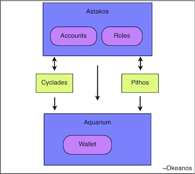
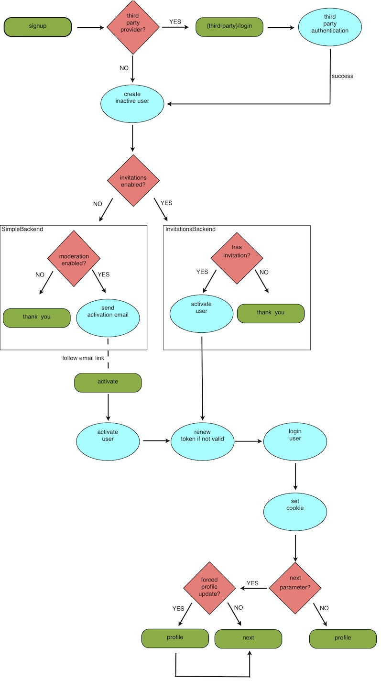

.. _astakos:

Identity Management Service (Astakos)
^^^^^^^^^^^^^^^^^^^^^^^^^^^^^^^^^^^^^^

Astakos is GRNET project that provides identity management, catalog and policy services.
It is designed to be used by the synnefo family software,
but is free and open to use by anybody, under a BSD-2 clause license.

Introduction
============

Astakos serves as a unique point of authentication for `GRNET <http://www.grnet.gr>`_
cloud services. It is a platform-wide service that allows users to manage their accounts.

Users in astakos can be authenticated via several identity providers:

 * Local
 * Shibboleth

It extends the ``snf-manage`` command line tool by introducing commands for managing the user accounts.

It is build over django and extends its authentication mechanism.

This document's goals are:

 * present the overall architectural design.
 * provide basic use cases.

The present document is meant to be read alongside the `Django documentation
<https://www.djangoproject.com/>`_. Thus, it is suggested that the reader is
familiar with associated technologies.

Astakos Architecture
====================

Overview
--------

Astakos service co-ordinates the access to resources (and the subsequent
permission model) and acts as the single point of registry and entry to the
GRNET cloud offering, comprising of Cyclades and Pithos subsystems.

It also propagates the user state to the Aquarium pricing subsystem.

Registration Use Cases
----------------------

The following subsections describe two basic registration use cases. All the
registration cases are illustrated in :ref:`registration-flow-label`

Invited user
~~~~~~~~~~~~

.. note::

   Invitation feature is currently disabled.

A registered ~okeanos user, invites student Alice to subscribe to ~okeanos
services. Alice receives an email and through a link is navigated to Astakos's
signup page. The system prompts her to select one of the available
authentication mechanisms (Shibboleth, local authentication) in
order to register to the system. Alice already has a Shibboleth account so
chooses that and then she is redirected to her institution's login page. Upon
successful login, her account is created.

Since she is invited her account is automaticaly activated and she is
redirected to Astakos's login page. As this is the first time Alice has
accessed the system she is redirected to her profile page where she can edit or
provide more information.

Not invited user
~~~~~~~~~~~~~~~~

Tony while browsing in the internet finds out about ~okeanos services. He
visits the signup page and fills the signup form. Since his not an invited
user his account has to be activated from an administrator first,
in order to be able to login. Upon the account's activation he receives
an email and through a link he is redirected to the login page.

Authentication Use Cases
------------------------

Cloud service user
~~~~~~~~~~~~~~~~~~

Alice requests a specific resource from a cloud service ex. Pithos. In the
request supplies the `X-Auth-Token` to identify whether she is eligible to
perform the specific task. The service contacts Astakos through its
``/astakos/api/authenticate`` api call (see :ref:`authenticate-api-label`)
providing the specific ``X-Auth-Token``. Astakos checkes whether the token
belongs to an active user and it has not expired and returns a dictionary
containing user related information. Finally the service uses the ``uniq``
field included in the dictionary as the account string to identify the user
accessible resources.

.. _registration-flow-label:

Registration Flow
-----------------

Responsible for handling the account registration and activation requests is the ``signup`` view. This view checks whether it is a request for a local account. If this is not the case, the user is navigated to the third-party provider to authenticate against it and upon success is redirected back in the ``signup`` view. If the supplied information is valid and an inactive account is created. Then the appropriate ``ActivationBackend`` handles the account activation: the ``InvitationsBackend`` if the invitation mechanism is enabled and the ``SimpleBackend`` otherwise.

In the first case, if the request is accompanied with a valid invitation code the user is automatically activated and since its email address (where received the invitation) is verified, acquires a valid token and is logged in the system. If there is no invitation associated with the request, the system check whether the email matches any of the ASTAKOS_RE_USER_EMAIL_PATTERNS and if it does it sends an email to the user to verify the email address, otherwise the system sends a notification email to the administrators and informs the user that the account activation will be moderated by them.

If the invitation mechanism is not enabled, the ``SimpleBackend`` checks if the email address matches any of the ASTAKOS_RE_USER_EMAIL_PATTERNS or the moderation is not enabled and it sends a verification email, otherwise informs the user that the account is pending approval and sends a notification email to the admins.

The verification email contains a link that navigates the user to ``activate`` view through a URI that contains also a temporary user token. If this token is valid the user account is activated and the user is logged in the system, after renewing the token and setting the cookie identified by ASTAKOS_COOKIE_NAME (used by the ~okeanos subcomponents).

If FORCE_PROFILE_UPDATE is set, after the first successful login the user is navigated first to the ``profile`` view, before been redirected to the ``next`` parameter value.

Login Flow
----------

During loging procedure the user is authenticated by the respective identity provider.

If ASTAKOS_RECAPTCHA_ENABLED is set and the user fails several times (ASTAKOS_RATELIMIT_RETRIES_ALLOWED setting) to provide the correct credentials for a local account, is prompted to solve a captcha challenge.

Upon success, the system renews the token (if it has been expired), logins the user and sets the cookie, before redirecting the user to the ``next`` parameter value.

.. image:: images/astakos-login.jpg
    :scale: 80%

Approval Terms
--------------

The ``snf-manage addterms`` command serves to add new approval terms.

During the account registration, if there are approval terms, the user has to agree with them in order to proceed.

In case there are later approval terms that the user has not signed, the ``signed_terms_required`` view decorator redirects to the ``approval_terms`` view.

Service Registration
--------------------

Services (ex. Cyclades, Pithos) are registered in astakos via ``snf-manage registerservice``. This command generates and prints a service token useful for accessing the service API.
Registered services can be viewed by ``snf-manage showservices`` command and ``snf-manage unregisterservice`` can be used to unregister a service.

.. _authentication-label:

Astakos Users and Authentication
--------------------------------

Astakos incorporates django user authentication system and extends its User model.

Since username field of django User model has a limitation of 30 characters,
AstakosUser is **uniquely** identified by the ``email`` instead. Therefore,
``astakos.im.authentication_backends.EmailBackend`` is served to authenticate a
user using email if the first argument is actually an email, otherwise tries
the username.

A new AstakosUser instance is assigned with a uui as username and also with a
``auth_token`` used by the cloud services to authenticate the user.
``astakos.im.authentication_backends.TokenBackend`` is also specified in order
to authenticate the user using the email and the token fields.

Logged on users can perform a number of actions:

 * access and edit their profile via: ``/im/profile``.
 * change their password via: ``/im/password``
 * invite somebody else via: ``/im/invite``
 * send feedback for grnet services via: ``/im/send_feedback``
 * logout (and delete cookie) via: ``/im/logout``

User entries can also be modified/added via the ``snf-manage`` commands.

Internal Astakos requests are handled using cookie-based django user sessions.

External systems should forward to the ``/login`` URI. The server,
depending on its configuration will redirect to the appropriate login page.
When done with logging in, the service's login URI should redirect to the URI
provided with next, adding user and token parameters, which contain the email
and token fields respectively.

The login URI accepts the following parameters:

======================  =========================
Request Parameter Name  Value
======================  =========================
next                    The URI to redirect to when the process is finished
renew                   Force token renewal (no value parameter)
force                   Force logout current user (no value parameter)
======================  =========================

External systems inside the ASTAKOS_COOKIE_DOMAIN scope can acquire the user information by the
cookie identified by ASTAKOS_COOKIE_NAME setting (set during the login procedure).

Finally, backend systems having acquired a token can use the
:ref:`authenticate-api-label` api call from a private network or through HTTPS.

