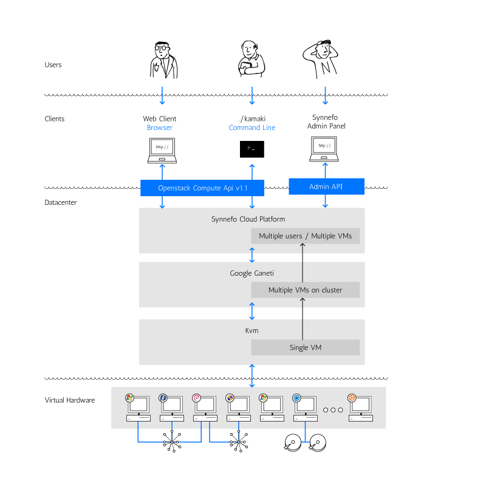

.. _cyclades:

Compute and Network Service (cyclades)
^^^^^^^^^^^^^^^^^^^^^^^^^^^^^^^^^^^^^^

Cyclades is the the synnefo Compute and Network Service.

It implements OpenStack Compute API v1.1 + synnefo extensions.

.. todo:: list synnefo components needed by cyclades

.. _cyclades-introduction:

Cyclades Introduction
=====================

Cyclades is the Compute/Network software component of *synnefo*. Its design combines a Google
Ganeti backend for VM cluster management, with a Python/Django implementation of
the user-visible API at the frontend. We opted to reuse Ganeti as a VM
management solution in an effort not to re-invent the wheel; Ganeti is scalable
and proven software infrastructure for managing VMs in production environments,
and GRNET already had long experience with it, using it to provide VMs to
Network Operation Centers. The synnefo team is involved in Ganeti development,
contributing patches upstream.

Basing our work on Ganeti, we build on a solid, mature core which undertakes
most of the low-level VM management operations, e.g., handling of VM creations,
migrations among physical nodes, and handling of node downtimes; the design and
implementation of the end-user API is orthogonal to VM handling at the backend.
Building on Ganeti gave us a head start, allowing us to focus on creating a
custom cloud management layer, accesible over a consistent, clean end-user API
implementation, and an intuitive Web-based UI.  Overall, the software stack is
as follows:

With *Cyclades*, users have access to VMs powered by KVM, running Linux and
Windows guests on Debian hosts and using Google Ganeti for VM cluster
management. The VMs are accessible by the end-user over the Web or
programmatically (OpenStack Compute API v1.1). Users have full control over
their VMs: they can create new ones, start them, shutdown, reboot, and destroy
them. For the configuration of their VMs they can select number of CPUs, size of
RAM and system disk, and operating system from pre-defined Images including
popular Linux distros (Fedora, Debian, Ubuntu) and MS-Windows Server 2008 R2.
There is an Out-of-Band console over VNC for troubleshooting.  

The REST API for VM management, being OpenStack Compute v. 1.1 compatible, can
interoperate with 3rd party tools and client libraries. GRNET has added custom
extensions for yet-unsupported functionality. It has been implemented in Python,
using the Django framework, from scratch.  

The *Cyclades* UI is written in Javascript/jQuery and runs entirely on the client
side for maximum reponsiveness. It is just another API client; all UI operations
happen with asynchronous calls over the API.

The networking functionality includes dual IPv4/IPv6 connectivity for each VM,
easy, platform-provided firewalling either through an array of pre-configured
firewall profiles, or through a roll-your-own firewall inside the VM. Users may
create multiple private, virtual L2 networks, so that they construct arbitrary
network topologie, e.g., to deploy VMs in multi-tier configurations. The
networking functionality is exported all the way from the backend to the API and
the UI.

.. _cyclades-architecture:

Cyclades Architecture
=====================

Nodes in an cyclades deployment belong in one of the following types.
For every type, we list the services that execute on corresponding nodes.
Throughout this guide, `node` refers to a physical machine in the deployment.

.. _DB_NODE:

DB
--

A node [or more than one nodes, if using an HA configuration], running a DB
engine supported by the Django ORM layer. The DB is the single source of
truth for the servicing of API requests by cyclades.

*Services:* PostgreSQL / MySQL

.. _APISERVER_NODE:

APISERVER
---------

A node running the ``api`` application contained in
:ref:`snf-cyclades-app <snf-cyclades-app>`. Any number of
:ref:`APISERVER <APISERVER_NODE>` nodes
can be used, in a load-balancing configuration, without any
special consideration. Access to a common DB ensures consistency.

*Services:* Web server, vncauthproxy

.. _QUEUE_NODE:

QUEUE
-----

A node running the RabbitMQ software, which provides AMQP functionality. More
than one :ref:`QUEUE <QUEUE_NODE>` nodes may be deployed, in an HA
configuration. Such deployments require shared storage, provided e.g., by DRBD.

*Services:* RabbitMQ [rabbitmq-server]

.. _LOGIC_NODE:

LOGIC
-----

A node running the business logic of synnefo, in Django. It dequeues
messages from QUEUE nodes, and provides the context in which business logic
functions run. It uses Django ORM to connect to the common DB and update the
state of the system, based on notifications received from the rest of the
infrastructure, over AMQP.

*Services:* the synnefo logic dispatcher, ``snf-dispatcher``

.. _GANETI_NODES:
.. _GANETI_MASTER:
.. _GANETI_NODE:

GANETI-MASTER and GANETI-NODE
-----------------------------

A single GANETI-MASTER and a large number of GANETI-NODEs constitute the
Ganeti backend for synnefo, which undertakes all VM management functions.
Any APISERVER can issue commands to the GANETI-MASTER, over RAPI, to effect
changes in the state of the VMs. The GANETI-MASTER runs the Ganeti request
queue.

*Services:*
    * only on :ref:`GANETI-MASTER <GANETI_MASTER>`:
        * the synnefo Ganeti monitoring daemon, ``snf-ganeti-eventd``
        * the synnefo Ganeti hook, ``ganeti/snf-ganeti-hook.py``.
    * on every :ref:`GANETI-NODE <GANETI_NODE>`:
        * a deployment-specific KVM ifup script
        * properly configured :ref:`NFDHCPD <cyclades-nfdhcpd-setup>`

..   src/design
..   src/dev
..   src/user
..   src/api

..   src/install
..   src/configuration
..   src/deployment
..   src/admin
..   src/admin_tools
..   src/develop
..   src/api
..   src/plankton
..   src/storage
..   src/upgrade
..   src/changelog

Indices and tables
==================

* :ref:`genindex`
* :ref:`modindex`
* :ref:`search`
