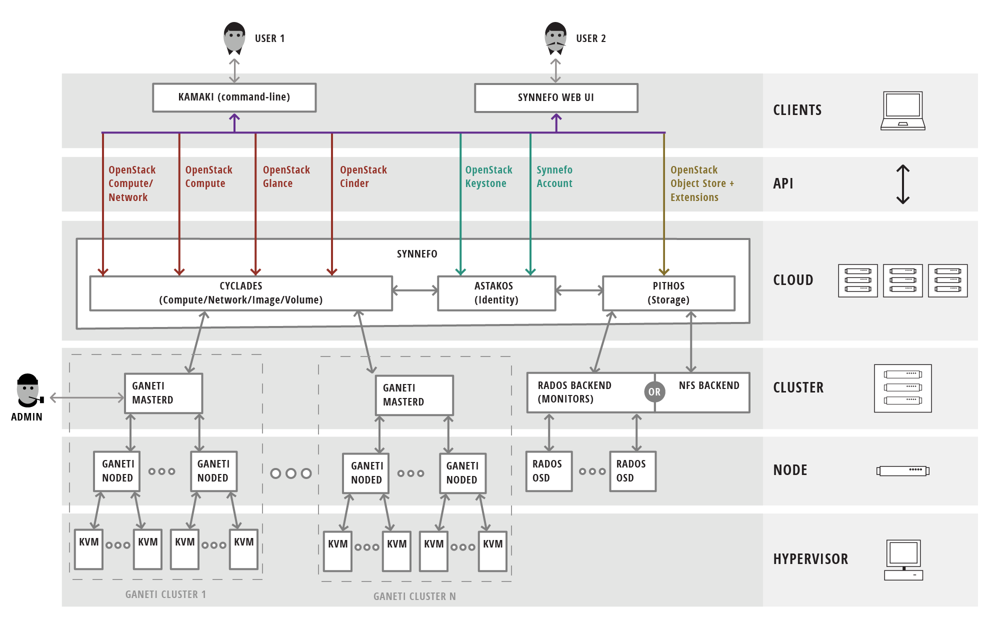

Welcome to the Synnefo documentation
^^^^^^^^^^^^^^^^^^^^^^^^^^^^^^^^^^^^

.. image:: /images/synnefo-logo.png

Synnefo is a complete open source IaaS cloud stack written in Python that
provides Compute, Network, Image, Volume and Object Storage services, similar to
the ones offered by AWS. Synnefo manages multiple `Ganeti
<http://code.google.com/p/ganeti>`_ clusters at the backend for handling of
low-level VM operations and uses `Archipelago
<http://www.synnefo.org/docs/archipelago/latest/>`_ to unify cloud storage. To
boost 3rd-party compatibility, Synnefo exposes the OpenStack APIs to users.

Synnefo came out of GRNET's `~okeanos public cloud service
<http://okeanos.grnet.gr>`_ and you can try it out live at `demo.synnefo.org
<http://demo.synnefo.org>`_.

Synnefo has three main components which provide the corresponding services:

.. toctree::
   :maxdepth: 1

   Astakos: Identity/Account/Quota services <astakos>
   Pithos: Object Storage service <pithos>
   Cyclades: Compute/Network/Image/Volume services <cyclades>

It :ref:`unifies storage resources <unify>` (Objects/Volumes/Images/Snapshots)
using Archipelago as the common storage substrate for all services.

This is an overview of the Synnefo services:

.. image:: images/synnefo-overview.png
   :width: 70%
   :target: _images/synnefo-overview.png

Synnefo is designed with simplicity, scalability and stability in mind.
Although it can be deployed in small configurations, it was initially designed
to address large-scale installation problems.

All Synnefo components use an intuitive settings mechanism, that adds and
removes settings dynamically as components are getting added or removed from a
physical node. All settings are stored in a single location.

.. _general-arch:

Synnefo General Architecture
============================

The following figure shows the whole Synnefo stack and how it interacts with
multiple Ganeti clusters and the storage backends. Synnefo decouples the cloud
from the cluster layer, enhancing robustness and easing administration and
upgrades without impacting VM stability. As shown in the figure below, Synnefo
sits on the cloud layer:

Synnefo manages multiple Ganeti clusters and different storage backends
(e.g., Ceph/RADOS or NFS-based backends as shown in the figure).

For an extensive view of all components, the interconnection and APIs between
them, please take a look at the Admin Guide's :ref:`corresponding figure
<syn+archip>`.

Synnefo Guides
==============

There are 4 guides for Synnefo.

The Quick Installation guide describes how to install Synnefo on a single node
in less than 10 minutes using the `snf-deploy` tool. This kind of installation
is targeted for testing and demo environments rather than production usage
deployments. It is the perfect way, even for an inexperienced user to have the
whole Synnefo stack up and running and allows for a quick preview of the basic
Synnefo features. This installation method is only available for Debian Wheezy.

The Admin's Installation guide describes how to install the whole Synnefo stack
in just two physical nodes. This guide is useful to those interested in
deploying Synnefo in large scale, as a starting point that will help them get
familiar with the Synnefo components and overall architecture, as well as the
interconnection between different services. This guide explains the whole
procedure step by step, without the use of the `snf-deploy` tool. Anyone
familiar with this guide, will be able to easily install Synnefo in a larger
number of nodes too, or even expand the two node installation dynamically.

The Administrator's Guide targets system administrators, who want to dive into
more details and common tasks regarding Synnefo. For the experienced Synnefo
administrator, there is also a section that describes how to do scale-out
Synnefo deployments with corresponding examples. This targets large scale
installations of Synnefo.

The Developer's Guide targets developers, who want to build on top of Synnefo
and so describes all the different types of interfaces Synnefo provides to the
external world. Also documents all Synnefo external REST APIs.

.. The Integrator's Guide targets developers, who want to actually
.. extend/modify/change Synnefo itself, so describes Synnefo's indepth
.. architecture and the internals of Synnefo components (currently out-of-date!).

* Quick Installation Guide on single node [:ref:`Debian Wheezy <quick-install-guide>`]
* Installation Guide on two nodes [:ref:`Debian Wheezy <install-guide-debian>` |
  :ref:`CentOS 6.5 <install-guide-centos>`]

.. toctree::
   :maxdepth: 1

   Administrator's Guide <admin-guide>
   Developer's Guide <dev-guide>
   API Guide <api-guide>

* :ref:`Upgrade notes <upgrade-notes>`
* :ref:`Changelog and NEWS <changelog-news>`

Synnefo tools
=============

There are also the following tools:

.. toctree::
   :maxdepth: 1

   kamaki: Command-line client <http://www.synnefo.org/docs/kamaki/latest/index.html>
   snf-deploy: Synnefo deployment tool <snf-deploy>
   snf-image-creator: Image bundling/uploading/registering tool <http://www.synnefo.org/docs/snf-image-creator/latest/index.html>
   snf-image: Secure image deployment tool <http://www.synnefo.org/docs/snf-image/latest/index.html>
   snf-burnin: Integration testing tool for a running Synnefo deployment <snf-burnin>

Design
======

v.0.17
------

.. toctree::
   :maxdepth: 1

    Detachable volumes <design/detachable-volumes>

v0.16
-----

.. toctree::
   :maxdepth: 1

   Logging mechanism for Synnefo's management commands <design/logging-management-commands>
   Resource-pool projects design <design/resource-pool-projects>
   Volumes design <design/volumes>
   Volume Snapshots design <design/volume-snapshots>

v0.15
-----

.. toctree::
   :maxdepth: 1

   Pithos separate view domain <design/pithos-separate-view-domain>
   Cyclades networking <design/cyclades-networking>
   Astakos resource defaults <design/resource-defaults>

Drafts
------

.. toctree::
   :maxdepth: 1

   Multi-DB transactions in Django <design/multi-db-transactions>

Contact
=======

You can contact the Synnefo team at the following mailing lists:

 * Users list: synnefo@googlegroups.com
 * Developers list: synnefo-devel@googlegroups.com

The official site is:

 `http://www.synnefo.org <http://www.synnefo.org>`_
