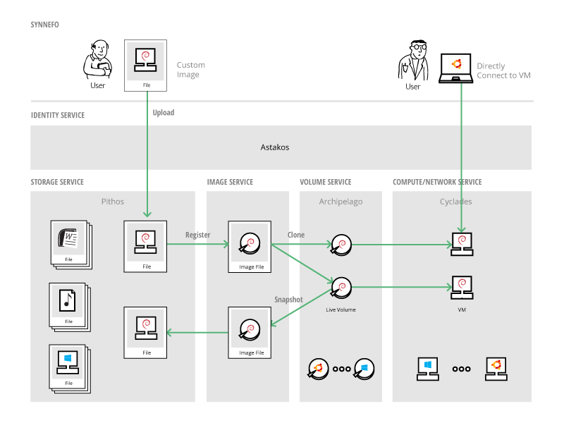

Welcome to Synnefo's documentation
^^^^^^^^^^^^^^^^^^^^^^^^^^^^^^^^^^

.. image:: /images/synnefo-logo.png

| Synnefo is open source cloud software, used to create massively scalable IaaS
  clouds.
| Synnefo uses `Google Ganeti <http://code.google.com/p/ganeti/>`_ for the low
  level VM management part.

| You can see Synnefo in action, powering GRNET's
  `~okeanos public cloud service <http://okeanos.io>`_.
| It is a collection of components (``snf-*``), most of them written in python, that
  are used as the building bricks to provide the following services:

.. toctree::
   :maxdepth: 1

   Identity Management (codename: astakos) <astakos>
   Object Storage Service (codename: pithos) <pithos>
   Compute Service (codename: cyclades) <cyclades>
   Network Service (part of Cyclades) <networks>
   Image Service (part of Cyclades) <plankton>
   Volume Storage Service (codename: archipelago) <archipelago>

There are also the following tools:

.. toctree::
   :maxdepth: 1

   kamaki: Command-line client <http://www.synnefo.org/docs/kamaki/latest/index.html>
   snf-deploy: Synnefo deployment tool <snf-deploy>
   snf-image-creator: Image bundling/uploading/registering tool <http://www.synnefo.org/docs/snf-image-creator/latest/index.html>
   snf-image: Secure image deployment tool <snf-image>
   snf-burnin: Integration testing tool for a running Synnefo deployment <snf-burnin>

Synnefo is designed to be as simple, scalable and production ready as possible.
Furthermore, although it can be deployed in small configurations, its prime
target is large installations.

All Synnefo components use an intuitive settings mechanism, that adds and removes
settings dynamically as components are getting added or removed from a physical
node. All settings are stored in a single location.

.. _general-arch:

Synnefo General Architecture
============================

The following graph shows the whole Synnefo architecture and how it interacts
with multiple Ganeti clusters.

.. image:: images/synnefo-arch2.png
   :width: 100%
   :target: _images/synnefo-arch2.png

Synnefo also supports RADOS as an alternative storage backend for
Files/Images/VM disks. :ref:`Here <syn+archip+rados>` is a graph that shows
Synnefo running with two different storage backends.

Synnefo Guides
==============

There are 3 guides for Synnefo.

.. For the really impatient snf-deploy tool allows you to install all software
.. components from scratch (creating locally kvm based Virtual Machines) or to an
.. existing cluster (in the same network subnet and domain, same network
.. configuration, vanilla debian squeeze and installed ssh keys). Please note that
.. this should be used only for testing or demo installations because most of the
.. times the prerequisites cannot be satisfied due to the underlying
.. infrastructure complexity (especially as far as networks is concerned).

The admin's installation guide describes how to install the whole Synnefo stack
in just two physical nodes, for testing purposes. This guide is useful to those
interested in deploying Synnefo in large scale, as a starting point that will
help them get familiar with the Synnefo components and overall architecture, as
well as the interconnection between different services. Such an installation,
also provides a quick preview of the basic Synnefo features, although we like to
think that Synnefo's real power unveils while scaling.

The Administrator's Guide targets system administrators, who want to dive into
more details and common tasks regarding Synnefo. For the experienced Synnefo
administrator, there is also a section that describes how to do scale-out
Synnefo deployments with corresponding examples. This targets large scale
installations of Synnefo.

The Developer's Guide targets developers, who want to build on top of Synnefo
and so describes all the different types of interfaces Synnefo provides to the
external world. Also documents all Synnefo external REST APIs.

.. The Integrator's Guide targets developers, who want to actually
.. extend/modify/change Synnefo itself, so describes Synnefo's indepth
.. architecture and the internals of Synnefo components (currently out-of-date!).

.. toctree::
   :maxdepth: 1

   Installation Guide (on two nodes) <quick-install-admin-guide>

.. toctree::
   :maxdepth: 2

   Administrator's Guide <admin-guide>
   Developer's Guide <dev-guide>

List of all Synnefo components
==============================

They are also available from our apt repository: ``apt.dev.grnet.gr``

 * `snf-common <http://www.synnefo.org/docs/snf-common/latest/index.html>`_
 * `snf-webproject <http://www.synnefo.org/docs/snf-webproject/latest/index.html>`_
 * `snf-astakos-app <http://www.synnefo.org/docs/astakos/latest/index.html>`_
 * `snf-pithos-backend <http://www.synnefo.org/docs/pithos/latest/backends.html>`_
 * `snf-pithos-app <http://www.synnefo.org/docs/pithos/latest/index.html>`_
 * `snf-pithos-webclient <http://www.synnefo.org/docs/pithos-webclient/latest/index.html>`_
 * `snf-cyclades-app <http://www.synnefo.org/docs/snf-cyclades-app/latest/index.html>`_
 * `snf-cyclades-gtools <http://www.synnefo.org/docs/snf-cyclades-gtools/latest/index.html>`_
 * `astakosclient <http://www.synnefo.org/docs/astakosclient/latest/index.html>`_
 * `snf-vncauthproxy <https://code.grnet.gr/projects/vncauthproxy>`_
 * `snf-image <https://code.grnet.gr/projects/snf-image/wiki/>`_ 
 * `snf-image-creator <http://www.synnefo.org/docs/snf-image-creator/latest/index.html>`_
 * `snf-occi <http://www.synnefo.org/docs/snf-occi/latest/index.html>`_
 * `snf-cloudcms <http://www.synnefo.org/docs/snf-cloudcms/latest/index.html>`_
 * `nfdhcpd <https://code.grnet.gr/projects/nfdhcpd>`_

Contact
=======

You can contact the Synnefo team at the following mailing lists:

 * Users list: synnefo@googlegroups.com
 * Developers list: synnefo-devel@googlegroups.com

The official site is:

 `http://www.synnefo.org <http://www.synnefo.org>`_

Indices and tables
==================

* :ref:`genindex`
* :ref:`modindex`
* :ref:`search`
