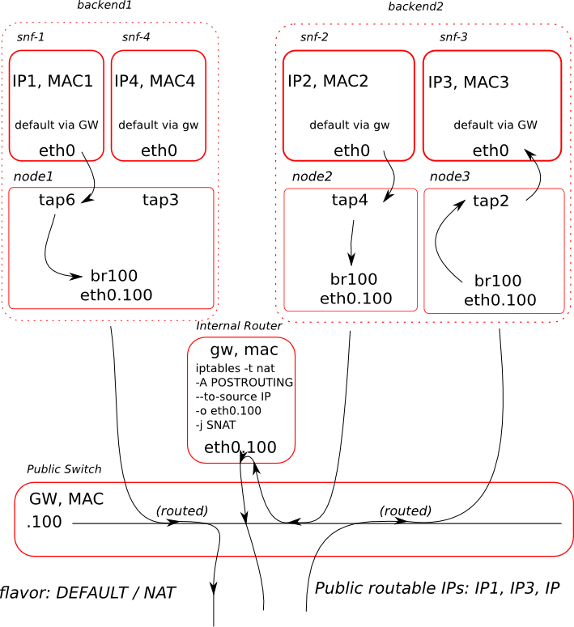
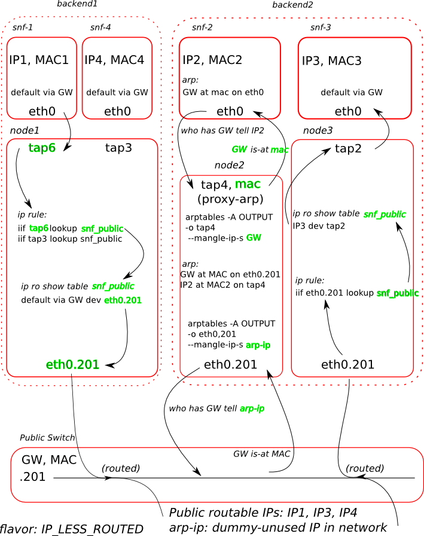
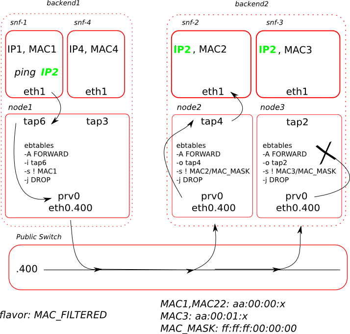
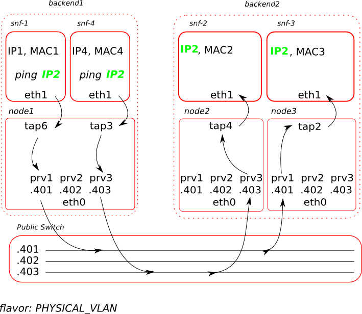

.. _networks:

Network Service (part of Cyclades)
^^^^^^^^^^^^^^^^^^^^^^^^^^^^^^^^^^

Network setup overview
======================

Currently the Network Service is part of Cyclades and comes along with the
Cyclades software components.

Networking is deployment-specific and must be customized based on the specific
needs of the system administrator. However, to do so, the administrator needs
to understand how each level handles Virtual Networks, to be able to setup the
backend appropriately.

Since v0.11 Synnefo supports multiple Ganeti clusters (backends). Having in
mind that every backend has its locality, there is a high possibility each
cluster to have different infrastracture (wires, routers, subnets, gateways,
etc.).

In the following sections we investigate in a top-down approach, the way
networks are defined from the Cyclades, Ganeti, and Backend persperctive.

Network @ Cyclades level
------------------------

Cyclades networks support a range of different options to cover the specific
needs of each deployment.

First of all, as far as visibility and accessibility is concerned, a network
can be either `public` or `private`. Public networks are created by the
administrator via the command line interface (`snf-manage`) and are visible to
all end-users. On the other hand, private networks are created by the end-user
from the Web UI or the kamaki client and provide isolated Layer 2 connectivity
to the end-user.

Both networks can have an IPv4 subnet or/and an IPv6 subnet along with the
corresponding gateway. For IPv4 networks, if the `--dhcp` option is set,
Cyclades will treat the IPv4 subnet as an IP pool, and will assign to each VM
that is connected to this network an IPv4 address from this pool.

A public network can also be marked as a floating IP pool with the
`--floating-ip-pool` option. Floating IPs, are IPv4 addresses that can be
dynamically by added and removed from running VMs. A user can reserve and
release a floating IP address that he can later add and remove it from running
VMs. Also the user can release a floating IP if it not used by any of his
VMs.

Private networks and floating IPs must be accessible from all instances across
all Ganeti backends. So, such networks must exist in all backends, and
are dynamically created when new Ganeti backends are added. Specially for
private networks, to avoid the overhead of creating the network to all
backends, Cyclades create these networks on demand, when an instance that
lives in a backend tries to connect to this network.

The administrator may also want to connect instances to some network, without
supporting floating IPs (e.g. to enforce each VM to be connected to a specific
network). This can be achieved by setting the `DEFAULT_INSTANCE_NETWORKS`
setting to the list of the selected networks. The special keyword
`SNF:ANY_PUBLIC` may be used as a network identifier, to indicate to the system
to peak any of the public networks that has a free IP address. Public networks
that are not floating IP pools, do not need to exist to all Ganeti backends,
since the Cyclades backend allocator, will route spawned vms to a Ganeti
backend that the selected networks exist. The administrator can choose in
which backends to create the network via the `--backends` command line option.

Another distinction between networks is their flavor. Flavor is a way to
abstract infrastructure specific options, that are used to ensure connectivity
and isolation to the VMs connected to the network. It is a set of options that
eventually will guide scripts to set up rules, while creating virtual
interfaces in the node level. Each of these flavors define attributes that will
be used at Ganeti level to create the physical network. These attributes are:

* ``mode``: Whether the network is in 'bridged' or 'routed' mode.
* ``link``: Bridge for 'bridged' networks and routing table for 'routed'
  networks. e.g. 'br100', 'rt200'
* ``mac_prefix``: A MAC prefix for the network. e.g. 'aa:00:05'
* ``tags``: A list of tags to be used at the Ganeti level.

To ensure L2 isolation, Synnefo supports two different mechanisms (see also Node
Level section):

* assigning one physical VLAN per network
* assigning one MAC prefix per network, so that every NIC attached to this
  network will have this prefix. Isolation is then achieved by filtering
  rules (via `ebtables`) based on a specific mask (ff:ff:f0:00:00:00, see Node
  Level section for more details).

Having this in mind and in order to prevent assignment of duplicate VLAN/MAC
prefix to different networks, Synnefo supports two types of Pools:

- Bridge Pool (corresponding to a number of VLANs bridged to those bridges)
- MAC prefix Pool

For Pool handling refer to the corresponding doc section. To use this pools,
set either `--link` or `--mac-prefix` to the reserved keyword `pool`.

Existing network flavors are the following:

==============   =======   ===============================   ======================  ==================
Flavor Name      Mode      Link                              MAC prefix              Tags
==============   =======   ===============================   ======================  ==================
IP_LESS_ROUTED   routed    ``DEFAULT_ROUTING_TABLE``         ``DEFAULT_MAC_PREFIX``  'ip-less-routed'
MAC_FILTERED     bridged   ``DEFAULT_MAC_FILTERED_BRIDGE``   'pool'                  'private'filtered'
PHYSICAL_VLAN    bridged   'pool'                            ``DEFAULT_MAC_PREFIX``  'physical-vlan'
CUSTOM           bridged   ``DEFAULT_BRIDGE``                ``DEFAULT_MAC_PREFIX``
==============   =======   ===============================   ======================  ==================

``DEFAULT_ROUTING_TABLE``, ``DEFAULT_MAC_PREFIX``, ``DEFAULT_BRIDGE``,
``DEFAULT_MAC_FILTERED_BRIDGE`` are all configurable settings in
``/etc/synnefo/20-snf-cyclades-app-api.conf``. 'pool' is used to denote that a
link or MAC prefix will be allocated from the corresponding Pool. Finally,
most of these attributes, may be overridden when creating networks with
`snf-manage network-create command`.

The administrator is able to create any of the above flavors
and override their default values by explicitly passing mode, link, etc. using
the `snf-manage network-create` command. 

The administrator can create networks of any flavor, but end-users is allowed
to create via API only networks with flavors that are set in the
`API_ENABLED_NETWORK_FLAVORS` setting.

Network @ Ganeti level
----------------------

Currently, stable Ganeti does not support IP Pool management. However, the
functionality has been merged in the official Ganeti master branch and will
appear on Ganeti 2.7.0. So, you can either checkout the Ganeti master branch
and build your packages, or clone our local repo
https://code.grnet.gr/git/ganeti-local and checkout the
`stable-2.6-ippool-hotplug-esi` branch. This is the Ganeti stable branch with
IP pool management, Hotplugging and ExtStorage Interface features merged on top
of it. The last two features are not a hard Synnefo requirement, but will
enable you to do neat things when you get experienced with Synnefo. They are
going to be pushed for review upstream sometime soon.

Any network created in Synnefo is also created in one (for public networks) or
all (for private networks) Ganeti backends. In Ganeti a network can have the
following options:

 - network (192.168.0.0/24, mandatory)
 - gateway (192.168.0.1)
 - network6 (2001:648:2ffc:1201::/64)
 - gateway6 (2001:648:2ffc:1201::1)
 - mac_prefix (aa:00:01)
 - type (private, public)
 - tags

Networks in Ganeti cannot be used unless they are connected to a nodegroup in
order to define the connectivity mode and link. Synnefo, after creating a
network, connects it to all nodegroups of the Ganeti cluster(s) with the given
mode and link (defined in the network flavor).

Ganeti makes use of environment variables to inform scripts about each NIC's
setup. `kvm-vif-script` that comes with `snf-network` sets up the nfdhcpd lease and
applies any rules needed depending on the network's mode, link, mac_prefix and
tags.

Network @ Physical host level
-----------------------------

Currently, networking infrastructure must be pre-provisioned before creating
networks in Synnefo. According to which flavors you want to support, you should
have already setup all your physical hosts correspondingly. This means you
need:

 - one bridge for the ``CUSTOM`` flavor (br0, see Fig. 1)
 - one bridge for the ``MAC_FILTERED`` flavor (prv0, see Fig. 2)
 - a number of bridges and their corresponding VLANs (bridged to them) for
   the ``PHYSICAL_VLAN`` flavor (prv1..prv100, see Fig. 3)
 - a routing table for the ``IP_LESS_ROUTED`` flavor (snf_public, see Fig. 4)

Please refer to the following figures, which clarify each infrastructure setup
and how connectivity and isolation is achieved in every case for every type of
network.

FLAVORS
=======

As mentioned earlier supported flavors are:

 - CUSTOM
 - IP_LESS_ROUTED
 - MAC_FILTERED
 - PHYSICAL_VLAN

In the following sections we mention what configuration imposes each flavor from
Synnefo, Ganeti and Physical host perspective.

DEFAULT SCENARIO
----------------

In this case we will bridge all primary interfaces of the VMs on one bridge that must
be the same collition domain with the router. The router sould then forward packets
(if a public IPv4 Subnet is available) or do NAT in order to provide internet access to
the VMs.

To this end we will use the CUSTOM flavor and pre-provision in each Ganeti
node one bridge (e.g. ``br100``). If we assume that ``eth1`` is the physical interface
connected to the router, run:

.. code-block:: console

   # brctl addbr br100
   # brctl addif br100 eth1
   # ip link set br100 up

   # brctl show
   bridge name bridge id         STP enabled interfaces
   br100       8000.8a3c3ede3583 no          eth1

Then in Cyclades run:

.. code-block:: console

   # snf-manage network-create --subnet=5.6.7.0/27 --gateway=5.6.7.1 --subnet6=2001:648:2FFC:1322::/64 --gateway6=2001:648:2FFC:1322::1 --public --dhcp=True --flavor=CUSTOM --link=br100 ----name=default --backend-id=1

   # snf-manage network-list
   id    name     flavor   owner mac_prefix   dhcp    state         link  vms public IPv4 Subnet   IPv4 Gateway
   1     default  CUSTOM                      True    ACTIVE        br100     True   5.6.7.0/27    5.6.7.1

This will add a network in Synnefo DB and create a network in Ganeti backend by
issuing:

.. code-block:: console

   # gnt-network add --network=5.6.7.0/27 --gateway=5.6.7.1 --network6=2001:648:2FFC:1322::/64 --gateway6=2001:648:2FFC:1322::1 --network-type=public --tags=nfdhcpd snf-net-1

   # gnt-network connect snf-net-1 default bridged br100
   # gnt-network list snf-net-1
   Network   Subnet     Gateway NetworkType MacPrefix GroupList               Tags
   snf-net-1 5.6.7.0/27 5.6.7.1 public      None      default(bridged, br100) nfdhcpd

To enable NAT in a Internal Router if you do not have a public IP range available
but only a public routable IP (e.g 1.2.3.4):

.. code-block:: console

   # ip addr add 5.6.7.1/27 dev eth1
   # iptables -t nat -A POSTROUTING -o eth1 --to-source 1.2.3.4 -j SNAT

IP_LESS_ROUTED
--------------

To create a network with IP_LESS_ROUTED flavor run you have to pre-provision in
each Ganeti node one routing table (e.g. ``snf_public``) that will do all the
routing from/to the VMs' taps. Additionally you must enable ``Proxy-ARP``
support. All traffic will be on a single iterface (e.g. ``eth1``).

.. code-block:: console

   # echo 1 > /proc/sys/net/ipv4/conf/ip_fowarding
   # echo 10 snf_public >> /etc/iproute2/rt_tables
   # ip route add 5.6.7.0/27 dev eth1
   # ip route add 5.6.7.0/27 dev eth1 table snf_public
   # ip route add default via 5.6.7.1 dev eth1 table snf_public
   # ip rule add iif eth1 lookup snf_public
   # arptables -A OUTPUT -o eth1 --opcode 1 --mangle-ip-s 5.6.7.30  # last ip in Subnet

Then in Cyclades run:

.. code-block:: console

   # snf-manage network-create --subnet=5.6.7.0/27 --gateway=5.6.7.1 --subnet6=2001:648:2FFC:1322::/64 --gateway6=2001:648:2FFC:1322::1 --public --dhcp=True --flavor=IP_LESS_ROUTED --name=routed --backend-id=1

   # snf-manage network-list
   id    name     flavor         owner mac_prefix   dhcp    state   link      vms  public IPv4 Subnet   IPv4 Gateway
   2     routed   IP_LESS_ROUTED                    True    ACTIVE  snf_public     True   5.6.7.0/27    5.6.7.1

This will add a network in Synnefo DB and create a network in Ganeti backend by
issuing:

.. code-block:: console

   # gnt-network add --network=5.6.7.0/27 --gateway=5.6.7.1 --network6=2001:648:2FFC:1322::/64 --gateway6=2001:648:2FFC:1322::1  --network-type=public  --tags=nfdhcpd,ip-less-routed  snf-net-2

   # gnt-network connect snf-net-2 default bridged br100
   # gnt-network list snf-net-2
   Network      Subnet            Gateway        NetworkType MacPrefix GroupList                   Tags
   dimara-net-1 62.217.123.128/27 62.217.123.129 public      None      default(routed, snf_public) nfdhcpd,ip-less-routed

MAC_FILTERED
------------

To create a network with MAC_FILTERED flavor you have to pre-provision in each Ganeti
node one bridge (e.g. ``prv0``) that will be bridged with one interface (e.g. ``eth2``)
across the whole cluster.

.. code-block:: console

   # brctl addbr prv0
   # brctl addif prv0 eth2
   # ip link set prv0 up

   # brctl show
   bridge name bridge id         STP enabled interfaces
   prv0        8000.8a3c3ede3583 no          eth2

Then in Cyclades first create a pool for MAC prefixes by running:

.. code-block:: console

   # snf-manage pool-create --type=mac-prefix --base=aa:00:0 --size=65536

and the create the network:

.. code-block:: console

   # snf-manage network-create --subnet=192.168.1.0/24 --gateway=192.168.1.0/24 --dhcp=True --flavor=MAC_FILTERED --link=prv0 --name=mac --backend-id=1
   # snf-manage network-list
   id    name     flavor       owner mac_prefix   dhcp    state         link  vms public IPv4 Subnet    IPv4 Gateway
   3     mac      MAC_FILTERED       aa:00:01     True    ACTIVE        prv0      False  192.168.1.0/24 192.168.1.1

Edit the synnefo setting `DEFAULT_MAC_FILTERED_BRIDGE` to `prv0`.

This will add a network in Synnefo DB and create a network in Ganeti backend by
issuing:

.. code-block:: console

   # gnt-network add --network=192.168.1.0/24  --gateway=192.168.1.1  --network-type=private  --tags=nfdhcpd,private-filtered snf-net-3

   # gnt-network connect snf-net-3 default bridged prv0
   # gnt-network list snf-net-3
   Network   Subnet         Gateway     NetworkType MacPrefix GroupList               Tags
   snf-net-3 192.168.1.0/24 192.168.1.1 private     aa:00:01  default(bridged, prv0) nfdhcpd,private-filtered

PHYSICAL_VLAN
-------------

To create a network with PHYSICAL_VALN flavor you have to pre-provision in each Ganeti
node a range of bridges (e.g. ``prv1..20``) that will be bridged with the corresponding VLANs (e.g. ``401..420``)
across the whole cluster. To this end if we assume that ``eth3`` is the interface to use, run:

.. code-block:: console

   # for i in {1..20}; do
      br=prv$i ; vlanid=$((400+i)) ; vlan=eth3.$vlanid
      brctl addbr $br ; ip link set $br up
      vconfig add eth0 vlanid ; ip link set vlan up
      brctl addif $br $vlan
   done
   # brctl show
   bridge name     bridge id               STP enabled     interfaces
   prv1            8000.8a3c3ede3583       no              eth3.401
   prv2            8000.8a3c3ede3583       no              eth3.402
   ...

Then in Cyclades first create a pool for bridges by running:

.. code-block:: console

   # snf-manage pool-create --type=bridge --base=prv --size=20

and the create the network:

.. code-block:: console

   # snf-manage network-create --subnet=192.168.1.0/24  --gateway=192.168.1.0/24  --dhcp=True --flavor=PHYSICAL_VLAN  --name=vlan  --backend-id=1

   # snf-manage network-list
   id    name     flavor       owner mac_prefix   dhcp    state         link  vms public IPv4 Subnet    IPv4 Gateway
   4     vlan     PHYSICAL_VLAN                   True    ACTIVE        prv1      False  192.168.1.0/24 192.168.1.1

This will add a network in Synnefo DB and create a network in Ganeti backend by
issuing:

.. code-block:: console

   # gnt-network add --network=192.168.1.0/24 --gateway=192.168.1.1 --network-type=private --tags=nfdhcpd,physica-vlan snf-net-4

   # gnt-network connect snf-net-4 default bridged prv1
   # gnt-network list snf-net-4
   Network   Subnet         Gateway     NetworkType MacPrefix GroupList               Tags
   snf-net-4 192.168.1.0/24 192.168.1.1 private     None      default(bridged, prv1)  nfdhcpd,physical-vlan

ADVANCED SCENARIO
-----------------

To create a network with CUSTOM flavor you have to pass your self mode, link,
mac prefix, tags for the network. You are not allowed to use the existing pools
(only MAC_FILTERED, PHYSICAL_VLAN use them) so link and mac prefix uniqueness
cannot be guaranteed.

Lets assume a bridge ``br200`` that serves a VPN network to GRNET already exists
on Ganeti nodes and we want to create for a certain user a private network so
that he can access the VPN. Then we run in Cyclades:

.. code-block:: console

   # snf-manage network-create --subnet=192.168.1.0/24 --gateway=192.168.1.0/24 --dhcp=True --flavor=CUSTOM --mode=bridged --link=br200 --mac-prefix=bb:00:44 --owner=user@grnet.gr --tags=nfdhcpd,vpn --name=vpn --backend-id=1

   # snf-manage network-list
   id    name     flavor       owner              mac_prefix   dhcp    state         link  vms public IPv4 Subnet    IPv4 Gateway
   5     vpn      CUSTOM       user@grnet.gr      bb:00:44     True    ACTIVE        br200     False  192.168.1.0/24 192.168.1.1

This will add a network in Synnefo DB and create a network in Ganeti backend by
issuing:

.. code-block:: console

   # gnt-network add --network=192.168.1.0/24 --gateway=192.168.1.1 --network-type=private --tags=nfdhcpd snf-net-5

   # gnt-network connect snf-net-5 default bridged br200
   # gnt-network list snf-net-5
   Network   Subnet         Gateway     NetworkType MacPrefix GroupList               Tags
   snf-net-5 192.168.1.0/24 192.168.1.1 private     bb:00:55  default(bridged, br200) nfdhcpd,private-filtered

