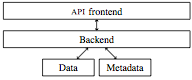
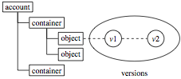
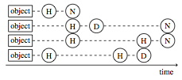

Object Storage Service (Pithos)
===============================

Pithos is an online storage service based on the OpenStack Object
Storage API with several important extensions. It uses a
block-based mechanism to allow users to upload, download, and share
files, keep different versions of a file, and attach policies to them.
It follows a layered, modular implementation. Pithos was designed to
be used as a storage service by the total set of the Greek research
and academic community (counting tens of thousands of users) but is
free and open to use by anybody, under a BSD-2 clause license.

A presentation of Pithos features and architecture is :download:`here <pithos-plus.pdf>`.

Introduction
------------

In 2008 the Greek Research and Technology Network (GRNET) decided
to offer an online storage service to the Greek research and academic
community. The service, called Pithos, was implemented in 2008-2009,
and was made available in spring 2009. It now has more than
12,000 users.

In 2011 GRNET decided to offer a new, evolved online storage
service, to be called Pithos. Pithos is designed to address the
main requirements expressed by the Pithos users in the first two years of
operation:

* Provide both a web-based client and native desktop clients for
  the most common operating systems.
* Allow not only uploading, downloading, and sharing, but also
  synchronization capabilities so that uses are able to select folders
  and have then synchronized automatically with their online accounts.
* Allow uploading of large files, regardless of browser
  capabilities (depending on the version,  browsers may place a 2
  GBytes upload limit).
* Improve upload speed; not an issue as long as the user is on a
  computer connected to the GRNET backbone, but it becomes important
  over ADSL connections.
* Allow access by
  non-Shibboleth (http://shibboleth.internet2.edu/).
  accounts. Pithos delegates user authentication to the Greek
  Shibboleth federation, in which all research and academic
  institutions belong. However, it is desirable to have the option to
  open up Pithos to non-Shibboleth authenticated users as well.
* Use open standards as far as possible.   

In what follows we describe the main features of Pithos, the elements
of its design and the capabilities it affords. We touch on related
work and we provide some discussion on our experiences and thoughts on
the future.

Pithos Features
---------------

Pithos is based on the OpenStack Object Storage API (Pithos
used a home-grown API). We decided to adopt an open standard
API in order to leverage existing clients that implement the
API. In this way, a user can access Pithos with a standard
OpenStack client - although users will want to use a Pithos client to
use features going beyond those offered by the OpenStack API.
The strategy paid off during Pithos development itself, as we were
able to access and test the service with existing clients, while also
developing new clients based on open source OpenStack clients.

The major extensions on the OpenStack API are:

* The use of block-based storage in lieu of an object-based one.
  OpenStack stores objects, which may be files, but this is not
  necessary - large files (longer than 5GBytes), for instance, must be
  stored as a series of distinct objects accompanied by a manifest.
  Pithos stores blocks, so objects can be of unlimited size.
* Permissions on individual files and folders. Note that folders
  do not exist in the OpenStack API, but are simulated by
  appropriate conventions, an approach we have kept in Pithos to
  avoid incompatibility.
* Fully-versioned objects.
* Metadata-based queries. Users are free to set metadata on their
  objects, and they can list objects meeting metadata criteria.
* Policies, such as whether to enable object versioning and to
  enforce quotas. This is particularly important for sharing object
  containers, since the user may want to avoid running out of space
  because of collaborators writing in the shared storage.
* Partial upload and download based on HTTP request
  headers and parameters.
* Object updates, where data may even come from other objects
  already stored in Pithos. This allows users to compose objects from
  other objects without uploading data.
* All objects are assigned UUIDs on creation, which can be
  used to reference them regardless of their path location.

Pithos Design
-------------

Pithos is built on a layered architecture (see Figure).
The Pithos server speaks HTTP with the outside world. The HTTP
operations implement an extended OpenStack Object Storage API.
The back end is a library meant to be used by internal code and
other front ends. For instance, the back end library, apart from being
used in Pithos for implementing the OpenStack Object Storage API,
is also used in our implementation of the OpenStack Image
Service API. Moreover, the back end library allows specification
of different namespaces for metadata, so that the same object can be
viewed by different front end APIs with different sets of
metadata. Hence the same object can be viewed as a file in Pithos,
with one set of metadata, or as an image with a different set of
metadata, in our implementation of the OpenStack Image Service.

The data component provides storage of block and the information
needed to retrieve them, while the metadata component is a database of
nodes and permissions. At the current implementation, data is saved to
the filesystem and metadata in an SQL database. In the future,
data will be saved to some distributed block storage (we are currently
evaluating RADOS - http://ceph.newdream.net/category/rados), and metadata to a NoSQL database.

Block-based Storage for the Client
^^^^^^^^^^^^^^^^^^^^^^^^^^^^^^^^^^

Since an object is saved as a set of blocks in Pithos, object
operations are no longer required to refer to the whole object. We can
handle parts of objects as needed when uploading, downloading, or
copying and moving data.

In particular, a client, provided it has access permissions, can
download data from Pithos by issuing a ``GET`` request on an
object. If the request includes the ``hashmap`` parameter, then the
request refers to a hashmap, that is, a set containing the
object's block hashes. The reply is of the form::

    {"block_hash": "sha1", 
     "hashes": ["7295c41da03d7f916440b98e32c4a2a39351546c", ...],
     "block_size":131072,
     "bytes": 242}

The client can then compare the hashmap with the hashmap computed from
the local file. Any missing parts can be downloaded with ``GET``
requests with an additional ``Range`` header containing the hashes
of the blocks to be retrieved. The integrity of the file can be
checked against the ``X-Object-Hash`` header, returned by the
server and containing the root Merkle hash of the object's
hashmap.

When uploading a file to Pithos, only the missing blocks will be
submitted to the server, with the following algorithm:

* Calculate the hash value for each block of the object to be
  uploaded.
* Send a hashmap ``PUT`` request for the object. This is a
  ``PUT`` request with a ``hashmap`` request parameter appended
  to it. If the parameter is not present, the object's data (or part
  of it) is provided with the request. If the parameter is present,
  the object hashmap is provided with the request.
* If the server responds with status 201 (Created), the blocks are
  already on the server and we do not need to do anything more.
* If the server responds with status 409 (Conflict), the server’s
  response body contains the hashes of the blocks that do not exist on
  the server. Then, for each hash value in the server’s response (or all
  hashes together) send a ``POST`` request to the server with the
  block's data.

In effect, we are deduplicating data based on their block hashes,
transparently to the users. This results to perceived instantaneous
uploads when material is already present in Pithos storage.

Block-based Storage Processing
^^^^^^^^^^^^^^^^^^^^^^^^^^^^^^

Hashmaps themselves are saved in blocks. All blocks are persisted to
storage using content-based addressing. It follows that to read a
file, Pithos performs the following operations:

* The client issues a request to get a file, via HTTP ``GET``.
* The API front end asks from the back end the metadata
  of the object.
* The back end checks the permissions of the object and, if they
  allow access to it, returns the object's metadata.
* The front end evaluates any HTTP headers (such as
  ``If-Modified-Since``, ``If-Match``, etc.).
* If the preconditions are met, the API front end requests
  from the back end the object's hashmap (hashmaps are indexed by the
  full path).
* The back end will read and return to the API front end the
  object's hashmap from the underlying storage.
* Depending on the HTTP ``Range`` header, the 
  API front end asks from the back end the required blocks, giving
  their corresponding hashes.
* The back end fetches the blocks from the underlying storage,
  passes them to the API front end, which returns them to the client.

Saving data from the client to the server is done in several different
ways.

First, a regular HTTP ``PUT`` is the reverse of the HTTP ``GET``.
The client sends the full object to the API front end.
The API front end splits the object to blocks. It sends each
block to the back end, which calculates its hash and saves it to
storage. When the hashmap is complete, the API front end commands
the back end to create a new object with the created hashmap and any
associated metadata.

Secondly, the client may send to the API front end a hashmap and
any associated metadata, with a special formatted HTTP ``PUT``,
using an appropriate URL parameter. In this case, if the
back end can find the requested blocks, the object will be created as
previously, otherwise it will report back the list of missing blocks,
which will be passed back to the client. The client then may send the
missing blocks by issuing an HTTP ``POST`` and then retry the
HTTP ``PUT`` for the hashmap. This allows for very fast uploads,
since it may happen that no real data uploading takes place, if the
blocks are already in data storage.

Copying objects does not involve data copying, but is performed by
associating the object's hashmap with the new path. Moving objects, as
in OpenStack, is a copy followed by a delete, again with no real data
being moved.

Updates to an existing object, which are not offered by OpenStack, are
implemented by issuing an HTTP ``POST`` request including the
offset and the length of the data. The API front end requests
from the back end the hashmap of the existing object. Depending on the
offset of the update (whether it falls within block boundaries or not)
the front end will ask the back end to update or create new blocks. At
the end, the front end will save the updated hashmap. It is also
possible to pass a parameter to HTTP ``POST`` to specify that the
data will come from another object, instead of being uploaded by the
client. 

Pithos Back End Nodes
^^^^^^^^^^^^^^^^^^^^^

Pithos organizes entities in a tree hierarchy, with one tree node per
path entry (see Figure). Nodes can be accounts,
containers, and objects. A user may have multiple
accounts, each account may have multiple containers, and each
container may have multiple objects. An object may have multiple
versions, and each version of an object has properties (a set of fixed
metadata, like size and mtime) and arbitrary metadata.

The tree hierarchy has up to three levels, since, following the
OpenStack API, everything is stored as an object in a container.
The notion of folders or directories is through conventions that
simulate pseudo-hierarchical folders. In particular, object names that
contain the forward slash character and have an accompanying marker
object with a ``Content-Type: application/directory`` as part of
their metadata can be treated as directories by Pithos clients. Each
node corresponds to a unique path, and we keep its parent in the
account/container/object hierarchy (that is, all objects have a
container as their parent).

Pithos Back End Versions
^^^^^^^^^^^^^^^^^^^^^^^^

For each object version we keep the root Merkle hash of the object it
refers to, the size of the object, the last modification time and the
user that modified the file, and its cluster. A version belongs
to one of the following three clusters (see Figure):

  * normal, which are the current versions
  * history, which contain the previous versions of an object
  * deleted, which contain objects that have been deleted

This versioning allows Pithos to offer to its user time-based
contents listing of their accounts. In effect, this also allows them
to take their containers back in time. This is implemented
conceptually by taking a vertical line in the Figure and
presenting to the user the state on the left side of the line.

Pithos Back End Permissions
^^^^^^^^^^^^^^^^^^^^^^^^^^^

Pithos recognizes read and write permissions, which can be granted to
individual users or groups of users. Groups as collections of users
created at the account level by users themselves, and are flat - a
group cannot contain or reference another group. Ownership of a file
cannot be delegated.

Pithos also recognizes a "public" permission, which means that the
object is readable by all. When an object is made public, it is
assigned a URL that can be used to access the object from
outside Pithos even by non-Pithos users. 

Permissions can be assigned to objects, which may be actual files, or
directories. When listing objects, the back end uses the permissions as
filters for what to display, so that users will see only objects to
which they have access. Depending on the type of the object, the
filter may be exact (plain object), or a prefix (like ``path/*`` for
a directory). When accessing objects, the same rules are used to
decide whether to allow the user to read or modify the object or
directory. If no permissions apply to a specific object, the back end
searches for permissions on the closest directory sharing a common
prefix with the object.

Related Work
------------

Commercial cloud providers have been offering online storage for quite
some time, but the code is not published and we do not know the
details of their implementation. Rackspace has used the OpenStack
Object Storage in its Cloud Files product. Swift is an open source
implementation of the OpenStack Object Storage API. As we have
pointed out, our implementation maintains compatibility with
OpenStack, while offering additional capabilities.

Discussion
----------

Pithos is implemented in Python as a Django application. We use SQLAlchemy
as a database abstraction layer. It is currently about
17,000 lines of code, and it has taken about 50 person months of
development effort. This development was done from scratch, with no
reuse of the existing Pithos code. That service was written in the
J2EE framework. We decided to move from J2EE to Python for
two reasons: first, J2EE proved an overkill for the original
Pithos service in its years of operation. Secondly, Python was
strongly favored by the GRNET operations team, who are the people
taking responsibility for running the service - so their voice is
heard.

Apart from the service implementation, which we have been describing
here, we have parallel development lines for native client tools on
different operating systems (MS-Windows, Mac OS X, Android, and iOS).
The desktop clients allow synchronization with local directories, a
feature that existing users of Pithos have been asking for, probably
influenced by services like DropBox. These clients are offered in
parallel to the standard Pithos interface, which is a web application
build on top of the API front end - we treat our own web
application as just another client that has to go through the API
front end, without granting it access to the back end directly.

We are carrying the idea of our own services being clients to Pithos
a step further, with new projects we have in our pipeline, in which a
digital repository service will be built on top of Pithos. It will
use again the API front end, so that repository users will have
all Pithos capabilities, and on top of them we will build additional
functionality such as full text search, Dublin Core metadata storage
and querying, streaming, and so on.

At the time of this writing (March 2012) Pithos is in alpha,
available to users by invitation. We will extend our user base as we
move to beta in the coming months, and to our full set of users in the
second half of 2012. We are eager to see how our ideas fare as we will
scaling up, and we welcome any comments and suggestions.

Acknowledgments
---------------

Pithos is financially supported by Grant 296114, "Advanced Computing
Services for the Research and Academic Community", of the Greek
National Strategic Reference Framework.

Availability
------------

The Pithos code is available under a BSD 2-clause license from:
https://code.grnet.gr/projects/pithos/repository

The code can also be accessed from its source repository:
https://code.grnet.gr/git/pithos/

More information and documentation is available at:
http://www.synnefo.org/docs/pithos/latest/index.html
